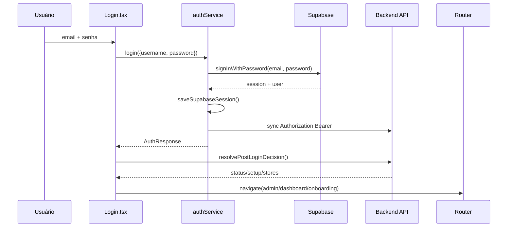
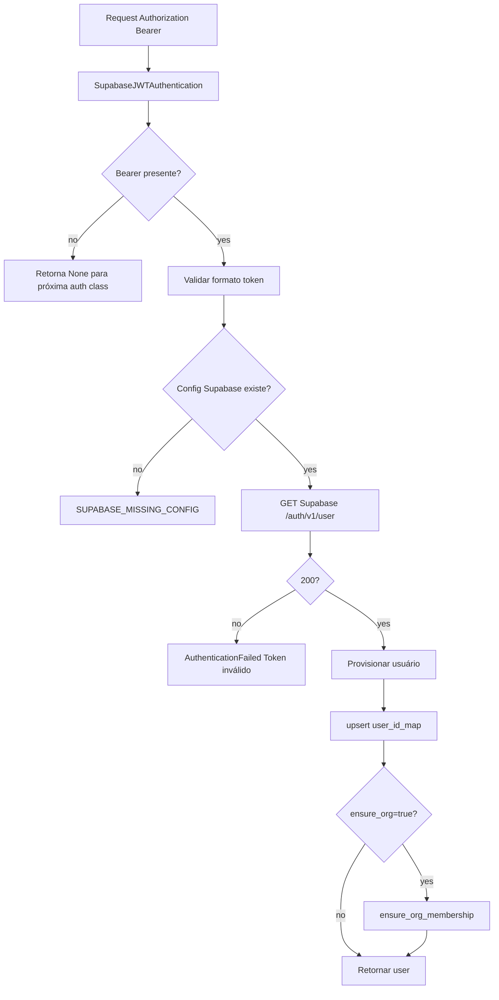
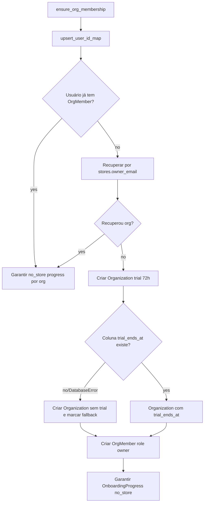
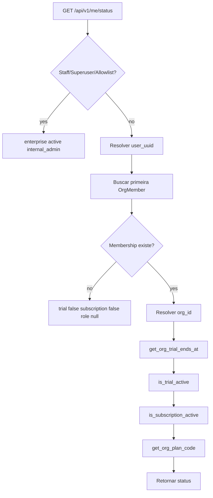
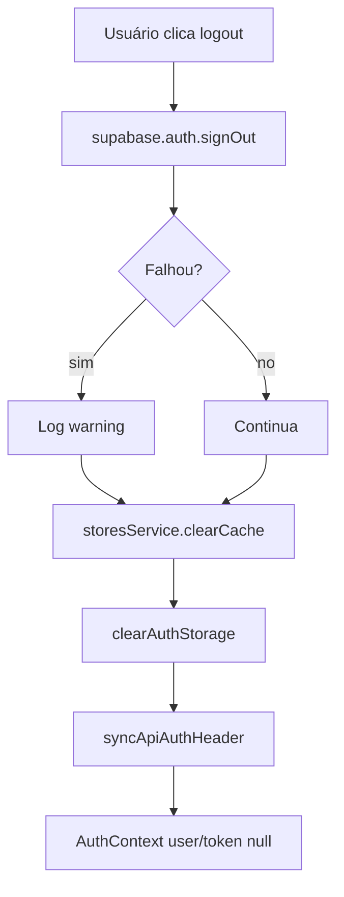

# Accounts, Fluxos

## Fluxo 1: Login Supabase no Frontend



## Fluxo 2: Callback de Email Supabase

```mermaid
flowchart TD
    A[/auth/callback] --> B[Ler code/hash/error da URL]
    B --> C{Tem erro?}
    C -- sim --> D[Mostrar ação necessária]
    C -- no --> E{Tem code?}
    E -- sim --> F[exchangeCodeForSession]
    E -- no --> G[getSession]
    F --> H{Sessão ok?}
    G --> H
    H -- no --> I{Hash tem access/refresh?}
    I -- sim --> J[setSession]
    I -- no --> K[Retry getSession até 6 vezes]
    J --> L[Obter user]
    K --> L
    H -- sim --> L
    L --> M{session + token + user?}
    M -- no --> D
    M -- yes --> N[Salvar authToken/userData]
    N --> O[refreshAuth + sync header]
    O --> P[resolver pós-login]
```

## Fluxo 3: Autenticação Supabase no Backend



## Fluxo 4: Provisionamento de Organização



## Fluxo 5: Setup State

```mermaid
sequenceDiagram
    participant FE as Frontend
    participant View as SetupStateView
    participant Supa as SupabaseJWTAuthentication
    participant Knox as Knox TokenAuthentication
    participant DB as Database

    FE->>View: GET /api/me/setup-state/ Bearer token
    View->>Supa: authenticate()
    alt Supabase OK
        Supa-->>View: user
    else Supabase None/Falha
        View->>Knox: authenticate()
        Knox-->>View: user ou falha
    end
    alt Sem user
        View-->>FE: 401 not_authenticated
    else User staff
        View->>DB: todas as stores
        View-->>FE: ready/no_store
    else User comum
        View->>DB: user_id_map -> OrgMember -> Stores
        View-->>FE: no_store ou ready
    end
```



## Fluxo 6: Status de Conta e Trial



## Fluxo 7: Private Route

```mermaid
flowchart TD
    A[/app/*] --> B[PrivateRoute]
    B --> C{isLoading ou !authReady?}
    C -- yes --> D[Spinner]
    C -- no --> E{isAuthenticated?}
    E -- no --> F[Navigate /login]
    E -- yes --> G[Render Layout]
```

## Fluxo 8: Logout



## Estados de Setup

| Estado | Condição | Uso no frontend | Confiança |
|---|---|---|---|
| `no_store` | Usuário sem org ou sem loja vinculada | Redirecionar para onboarding. | 🟢 |
| `ready` | Usuário possui loja acessível | Redirecionar para dashboard/continuar setup. | 🟢 |
| `internal_admin` | Staff/superuser/allowlist via `/me/status` | Redirecionar para admin. | 🟢 |

## Códigos e Erros

| Código / Erro | Origem | Significado | Confiança |
|---|---|---|---|
| `SUPABASE_MISSING_CONFIG` | Supabase auth/bootstrap/setup-state | Config provider ausente. | 🟢 |
| `SUPABASE_TOKEN_INVALID` | Bootstrap/setup-state | Token ausente, inválido ou expirado. | 🟢 |
| `SUPABASE_PROVISIONING_ERROR` | Supabase bootstrap/auth | Falha ao criar/atualizar usuário. | 🟢 |
| `DATABASE_ERROR` | SupabaseBootstrapView | Falha de persistência no bootstrap. | 🟢 |
| `PROVISIONING_ERROR` | SetupStateView | Falha de provisionamento. | 🟢 |
| `PERMISSION_DENIED` | Admin summary | Usuário não é staff/superuser. | 🟢 |
| `INVALID_METRIC` | Admin drilldown | Métrica desconhecida. | 🟢 |
| `ORG_SCHEMA_OUTDATED` | SetupStateView | Fallback por schema sem `trial_ends_at`. | 🟢 |

## Pontos de Controle

- 🟢 CONFIRMADO: Login legado não diferencia email inexistente e senha errada.
- 🟢 CONFIRMADO: Bootstrap frontend de conta Supabase é best-effort.
- 🟢 CONFIRMADO: Setup-state retorna JSON 401 com `request_id` quando sem auth.
- 🟢 CONFIRMADO: Staff/superuser têm bypass de trial/status.
- 🟢 CONFIRMADO: Admin control tower bloqueia usuário comum.
- 🔴 LACUNA: Branch de erro de banco em SupabaseBootstrapView pode falhar por ausência de import `settings`.
