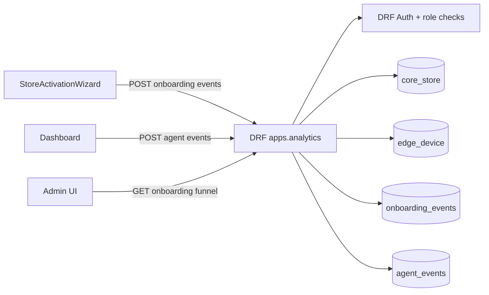

# Analytics - Design

## Visão Arquitetural

`apps.analytics` é um módulo Django/DRF de telemetria complementar. Ele recebe eventos do frontend autenticado e grava tabelas relacionais para análise de onboarding e atualização do agent. 🟢

A arquitetura é síncrona: requisição HTTP autenticada, validação de payload e autorização por loja, escrita no banco, resposta JSON curta. 🟢

## Componentes

| Componente | Responsabilidade | Confiança |
|---|---|---|
| `StoreDailyMetrics` | Métricas diárias agregadas por loja e data | 🟢 |
| `OnboardingEvent` | Eventos granulares do wizard de ativação | 🟢 |
| `AgentEvent` | Eventos de atualização do Edge Agent | 🟢 |
| `OnboardingEventIngestView` | Ingestão unitária ou em lote de eventos de onboarding | 🟢 |
| `AgentEventIngestView` | Ingestão de eventos de update do agent | 🟢 |
| `AdminOnboardingFunnelView` | Agregação de funil de onboarding para staff/superuser | 🟢 |
| `analyticsService` | Cliente frontend para postar telemetria e ler funil | 🟢 |
| `StoreActivationWizard` | Emissor principal de eventos de onboarding | 🟢 |
| `Dashboard` | Emissor de eventos de update do agent | 🟢 |

## Contratos HTTP

### `POST /api/v1/analytics/onboarding-event/`

Autenticação: `IsAuthenticated`. 🟢

Autorização: `require_store_role(user, store_id, ALLOWED_READ_ROLES)`. 🟢

Payload unitário:

```json
{
  "store_id": "uuid",
  "event_type": "onboarding_step_viewed",
  "step": "install_agent",
  "technical_status": "needs_attention",
  "time_spent_ms": 120000,
  "session_id": "string",
  "metadata": {}
}
```

Payload em lote:

```json
{
  "events": [
    { "store_id": "uuid", "event_type": "onboarding_step_viewed" }
  ]
}
```

Resposta de sucesso: HTTP 201 com `{ "ok": true, "inserted": n }`. 🟢

Falhas conhecidas:

| Condição | Status | Resposta | Confiança |
|---|---:|---|---|
| Lista vazia | 400 | `Nenhum evento recebido.` | 🟢 |
| Item não é objeto | 400 | `Formato de evento inválido.` | 🟢 |
| Falta `store_id` ou `event_type` | 400 | `store_id e event_type são obrigatórios.` | 🟢 |
| Evento fora da allowlist | 400 | `event_type inválido: ...` | 🟢 |
| Loja inexistente | 404 | `Loja não encontrada.` | 🟢 |
| Papel insuficiente | 403 esperado via `PermissionDenied`/permission helper | 🟡 |

### `POST /api/v1/analytics/agent-event/`

Autenticação: `IsAuthenticated`. 🟢

Autorização: `require_store_role(user, store_id, ALLOWED_MANAGE_ROLES)`. 🟢

Payload:

```json
{
  "store_id": "uuid",
  "event_type": "agent_update_triggered",
  "device_key": "edge-1",
  "from_version": "1.0.0",
  "to_version": "1.1.0",
  "metadata": {}
}
```

Resposta de sucesso: HTTP 201 com `{ "ok": true, "event_id": 123, "event_type": "agent_update_triggered" }`. 🟢

Se `device_key` não localizar `EdgeDevice`, o evento ainda é gravado sem dispositivo associado. 🟢

### `GET /api/v1/analytics/admin/onboarding-funnel/?days=N`

Autenticação: `IsAuthenticated`. 🟢

Autorização: apenas `is_staff` ou `is_superuser`. 🟢

Resposta:

```json
{
  "period_days": 30,
  "from": "2026-03-01T00:00:00+00:00",
  "to": "2026-03-31T00:00:00+00:00",
  "baseline_stores": 2,
  "funnel_counts": {},
  "conversion": {},
  "avg_time_to_active_min": 2.5,
  "top_dropoff_step": "install_agent",
  "dropoff_counts": {}
}
```

## Modelo de Dados

### `StoreDailyMetrics`

Tabela Django padrão com unicidade lógica por `(store, period_date)`. 🟢

Campos principais: `footfall_in`, `queue_avg_wait_min`, `staff_idle_minutes`, `priority_alerts_count`, `revenue_estimated`. 🟢

Não foram encontrados endpoints ativos que leiam ou escrevam diretamente esse modelo dentro de `apps.analytics`. 🟡

### `onboarding_events`

| Campo | Tipo lógico | Observação | Confiança |
|---|---|---|---|
| `id` | BigAutoField | PK | 🟢 |
| `store_id` | FK Store | CASCADE | 🟢 |
| `event_type` | string choice | Indexado | 🟢 |
| `step` | string opcional | Indexado | 🟢 |
| `technical_status` | string opcional | Estado técnico do onboarding | 🟢 |
| `time_spent_ms` | inteiro opcional | Normalizado para não-negativo quando possível | 🟢 |
| `session_id` | string opcional | Indexado | 🟢 |
| `metadata` | JSON | Sem schema fixo | 🟢 |
| `user_agent` | texto opcional | Copiado da requisição | 🟢 |
| `created_at` | datetime | Default `timezone.now`, indexado | 🟢 |

Índices: `(store, event_type, step)`, `created_at`, `(store, created_at)`. 🟢

### `agent_events`

| Campo | Tipo lógico | Observação | Confiança |
|---|---|---|---|
| `id` | BigAutoField | PK | 🟢 |
| `store_id` | FK Store | CASCADE | 🟢 |
| `device_id` | FK EdgeDevice nullable | SET_NULL | 🟢 |
| `event_type` | string choice | Indexado | 🟢 |
| `from_version` | string opcional | Versão origem | 🟢 |
| `to_version` | string opcional | Versão destino | 🟢 |
| `metadata` | JSON | Sem schema fixo | 🟢 |
| `created_at` | datetime | Default `timezone.now`, indexado | 🟢 |

Índices: `(store, event_type, created_at)` e `created_at`. 🟢

## Fluxos Internos

### Ingestão de onboarding

1. Recebe `request.data`. 🟢
2. Se existir `events` como lista, usa a lista; caso contrário trata o payload como evento único. 🟢
3. Valida lista não vazia. 🟢
4. Itera itens e valida tipo, `store_id`, `event_type` e allowlist. 🟢
5. Para cada `store_id` ainda não verificado, busca `Store` e checa papel de leitura. 🟢
6. Normaliza `time_spent_ms`. 🟢
7. Cria objetos `OnboardingEvent` em memória com `created_at=now` comum ao lote. 🟢
8. Persiste com `bulk_create(batch_size=500)`. 🟢
9. Retorna `inserted`. 🟢

### Ingestão de agent event

1. Recebe payload. 🟢
2. Valida `store_id` e `event_type`. 🟢
3. Valida allowlist. 🟢
4. Busca loja e checa papel de gestão. 🟢
5. Resolve `EdgeDevice` por `store_id + device_key`, se informado. 🟢
6. Cria `AgentEvent`. 🟢
7. Retorna ID do evento. 🟢

### Funil administrativo

1. Verifica staff/superuser. 🟢
2. Lê `days`, aplica fallback 30 e clamp 1..180. 🟢
3. Define janela `[now - days, now)`. 🟢
4. Filtra `OnboardingEvent` por `created_at` dentro da janela. 🟢
5. Calcula baseline por lojas com `onboarding_step_viewed` em `generate_token`. 🟢
6. Para cada etapa, calcula lojas distintas com `onboarding_step_completed`. 🟢
7. Calcula conversão percentual por etapa sobre baseline. 🟢
8. Calcula média de `time_spent_ms` em eventos `onboarding_completed`. 🟢
9. Calcula principal drop-off com `Counter`. 🟢
10. Retorna payload agregado. 🟢

## Integração Frontend

`analyticsService` encapsula três métodos: `trackOnboardingEvent`, `trackAgentEvent` e `getAdminOnboardingFunnel`. 🟢

Todas as chamadas usam `timeoutCategory: "best-effort"` e `noRetry: true`. 🟢

`StoreActivationWizard` captura falhas de tracking com `.catch(() => undefined)`, preservando a experiência principal do usuário. 🟢

`Dashboard` emite evento de update iniciado e sucesso percebido por comparação entre versão instalada e versão alvo pendente. 🟢

## Diagrama C4 Simplificado



## Decisões e Trade-offs

| Decisão | Benefício | Custo | Confiança |
|---|---|---|---|
| Telemetria best-effort no frontend | Não bloqueia onboarding/update | Pode perder evento em falha temporária | 🟢 |
| Sem retry no frontend | Evita duplicidade e latência | Reduz confiabilidade analítica | 🟢 |
| Bulk insert para onboarding | Melhor performance em lote | Falha de um item invalida o lote inteiro | 🟢 |
| `metadata` livre | Flexibilidade rápida de produto | Menor governança de schema | 🟢 |
| Funil por lojas distintas | Evita inflar conversão por múltiplos eventos | Não mede volume total de tentativas | 🟢 |

## Riscos

| Risco | Consequência | Mitigação sugerida | Confiança |
|---|---|---|---|
| Eventos duplicados por re-render ou reenvio | Conversão e drop-off distorcidos | Chave idempotente opcional por sessão/step/event_type | 🟡 |
| Ausência de emissor de `agent_update_failed` | Falhas de update invisíveis no analytics | Emitir evento no erro do request ou por status polling | 🔴 |
| Sem validação de tamanho de `metadata` | Payloads grandes no banco | Limitar tamanho e schema por evento | 🟡 |
| `StoreDailyMetrics` sem uso ativo identificado | Modelo órfão ou dívida de produto | Confirmar se deve migrar para core/reporting ou remover em versão futura | 🟡 |
