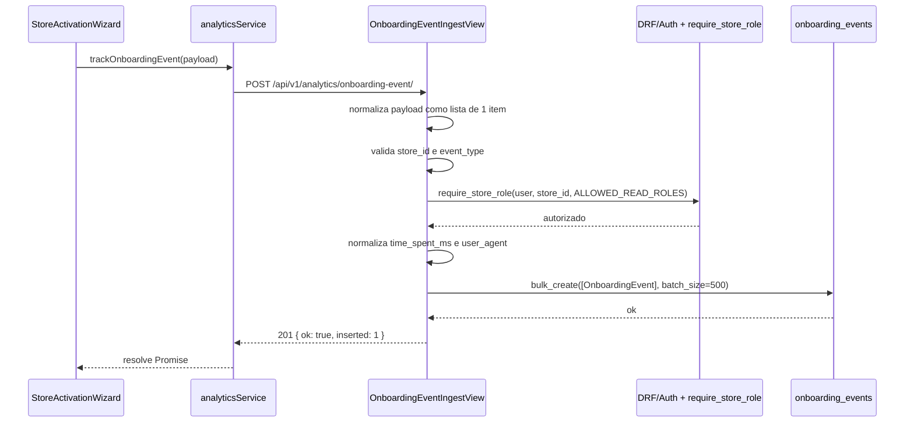
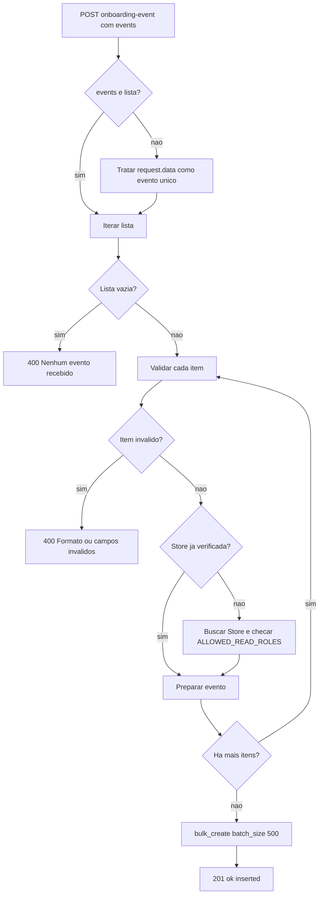
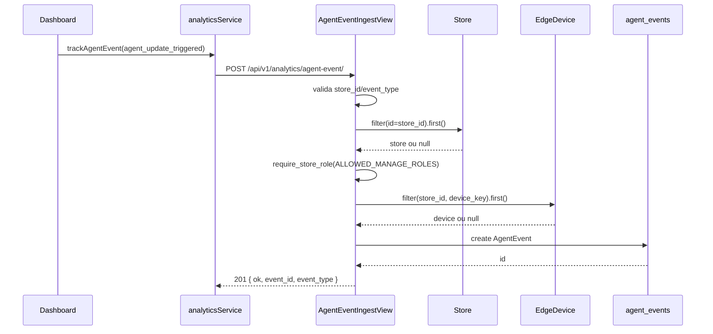
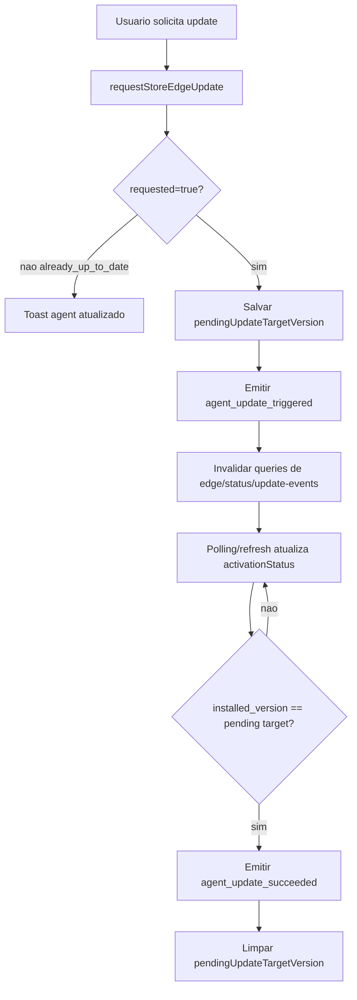
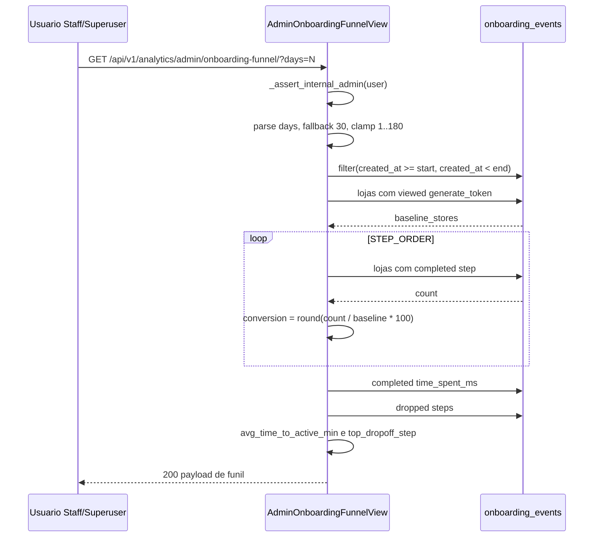
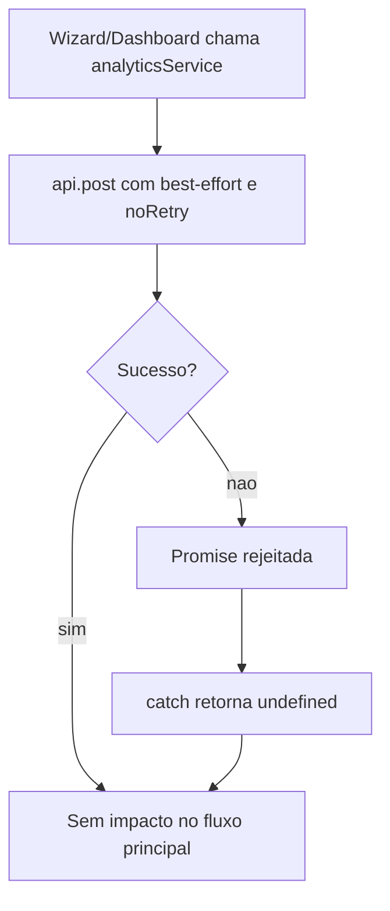

# Analytics - Flows

## Fluxo 1 - Evento de onboarding unitário

Confiança: 🟢 confirmado em `StoreActivationWizard.tsx`, `analytics.ts` e `views.py`.

## Fluxo 2 - Evento de onboarding em lote

Confiança: 🟢 confirmado em `OnboardingEventIngestView.post`.

## Fluxo 3 - Evento de update do agent

Confiança: 🟢 confirmado em `Dashboard.tsx`, `analytics.ts` e `AgentEventIngestView`.

## Fluxo 4 - Sucesso de update percebido pelo dashboard

Confiança: 🟢 confirmado em `Dashboard.tsx`.

Lacuna: `agent_update_failed` é tipo aceito, mas não foi encontrado fluxo emissor. 🔴

## Fluxo 5 - Funil administrativo de onboarding

Confiança: 🟢 confirmado em `AdminOnboardingFunnelView`.

## Fluxo 6 - Falha best-effort no frontend

Confiança: 🟢 confirmado em `analytics.ts`, `StoreActivationWizard.tsx` e `Dashboard.tsx`.

## Matriz de Estados/Eventos

| Origem | Evento | Momento | Persistência | Confiança |
|---|---|---|---|---|
| Wizard | `onboarding_step_viewed` | Entrada/alteração de etapa | `onboarding_events` | 🟢 |
| Wizard | `onboarding_step_completed` | Avanço de etapa | `onboarding_events` | 🟢 |
| Wizard | `onboarding_dropped` | Fechamento/desmontagem sem conclusão | `onboarding_events` | 🟢 |
| Wizard | `onboarding_completed` | Onboarding finalizado | `onboarding_events` | 🟢 |
| Dashboard | `agent_update_triggered` | Update solicitado e aceito | `agent_events` | 🟢 |
| Dashboard | `agent_update_succeeded` | Versão instalada alcança alvo | `agent_events` | 🟢 |
| Não encontrado | `agent_update_failed` | Falha de update | `agent_events` | 🔴 |

## Códigos e Respostas

| Caso | HTTP | Payload | Confiança |
|---|---:|---|---|
| Onboarding inserido | 201 | `{ ok: true, inserted: n }` | 🟢 |
| Agent event inserido | 201 | `{ ok: true, event_id, event_type }` | 🟢 |
| Funil calculado | 200 | objeto com `baseline_stores`, `conversion`, `dropoff_counts` | 🟢 |
| Evento inválido | 400 | `{ detail: "event_type inválido: ..." }` | 🟢 |
| Campos obrigatórios ausentes | 400 | `{ detail: "store_id e event_type são obrigatórios." }` | 🟢 |
| Loja inexistente | 404 | `{ detail: "Loja não encontrada." }` | 🟢 |
| Admin negado | 403 esperado via `PermissionDenied` | mensagem de acesso restrito | 🟡 |

## Pontos de Controle para Reimplementação

1. Manter rotas exatamente sob `/api/v1/analytics/`. 🟢
2. Preservar allowlists de eventos. 🟢
3. Preservar permissões distintas: leitura para onboarding, gestão para agent event. 🟢
4. Preservar tracking frontend best-effort sem retry. 🟢
5. Preservar cálculo de funil por lojas distintas, não por volume bruto de eventos. 🟢
6. Decidir explicitamente se duplicidade de eventos é comportamento aceito. 🔴
