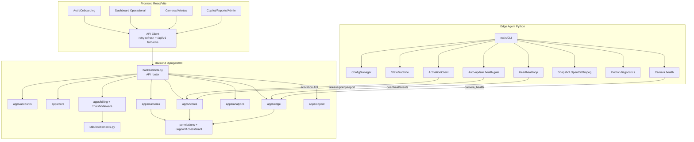

# C4 Componentes

Escala: 🟢 CONFIRMADO | 🟡 INFERIDO | 🔴 LACUNA

```mermaid
flowchart TB
    subgraph FE["Frontend React/Vite"]
        FEAuth["Auth/Onboarding"]
        FEDash["Dashboard Operacional"]
        FECameras["Cameras/Alertas"]
        FECopilot["Copilot/Reports/Admin"]
        FEApi["API Client\nretry refresh + /api/v1 fallbacks"]
    end
    subgraph BE["Backend Django/DRF"]
        URLs["backend/urls.py\nAPI router"]
        Accounts["apps/accounts"]
        Core["apps/core"]
        Stores["apps/stores"]
        Edge["apps/edge"]
        Cameras["apps/cameras"]
        Analytics["apps/analytics"]
        Billing["apps/billing + TrialMiddleware"]
        Copilot["apps/copilot"]
        Entitlements["utils/entitlements.py"]
        RBAC["permissions + SupportAccessGrant"]
    end
    subgraph EA["Edge Agent Python"]
        Main["main/CLI"]
        Config["ConfigManager"]
        State["StateMachine"]
        Activation["ActivationClient"]
        Heartbeat["Heartbeat loop"]
        Health["Camera health"]
        Snapshot["Snapshot OpenCV/ffmpeg"]
        Doctor["Doctor diagnostics"]
        Update["Auto-update health gate"]
    end

    FEAuth --> FEApi
    FEDash --> FEApi
    FECameras --> FEApi
    FECopilot --> FEApi
    FEApi --> URLs
    URLs --> Accounts
    URLs --> Core
    URLs --> Stores
    URLs --> Edge
    URLs --> Cameras
    URLs --> Analytics
    URLs --> Billing
    URLs --> Copilot
    Billing --> Entitlements
    Cameras --> RBAC
    Stores --> RBAC
    Edge --> RBAC
    Main --> Config
    Main --> State
    Main --> Activation
    Main --> Heartbeat
    Main --> Health
    Main --> Snapshot
    Main --> Doctor
    Main --> Update
    Activation -->|activation API| Stores
    Heartbeat -->|heartbeat/events| Edge
    Health -->|camera_health| Edge
    Update -->|release/policy/report| Stores
```
