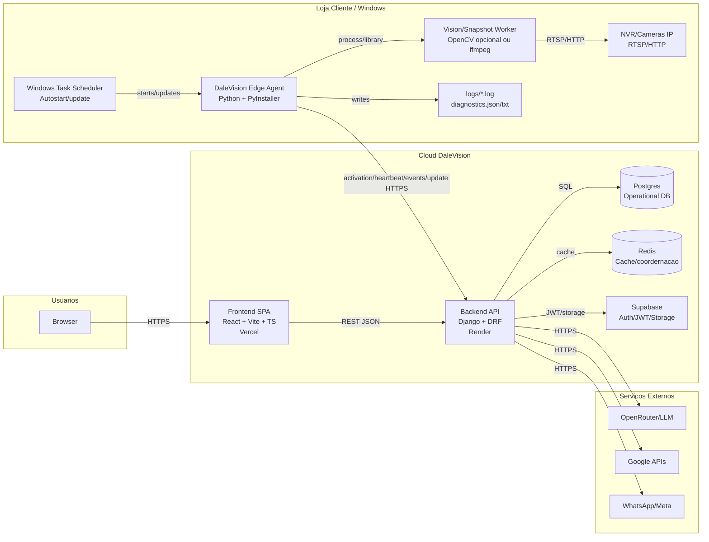

# C4 Containers

Escala: 🟢 CONFIRMADO | 🟡 INFERIDO | 🔴 LACUNA

```mermaid
flowchart LR
    subgraph User["Usuarios"]
        Browser["Browser"]
    end
    subgraph Cloud["Cloud DaleVision"]
        Frontend["Frontend SPA\nReact + Vite + TS\nVercel"]
        Backend["Backend API\nDjango + DRF\nRender"]
        DB[("Postgres\nOperational DB")]
        Redis[("Redis\nCache/coordernacao")]
        Storage["Supabase\nAuth/JWT/Storage"]
    end
    subgraph Client["Loja Cliente / Windows"]
        Agent["DaleVision Edge Agent\nPython + PyInstaller"]
        Vision["Vision/Snapshot Worker\nOpenCV opcional ou ffmpeg"]
        Scheduler["Windows Task Scheduler\nAutostart/update"]
        NVR["NVR/Cameras IP\nRTSP/HTTP"]
        Logs["logs/*.log\ndiagnostics.json/txt"]
    end
    subgraph External["Servicos Externos"]
        LLM["OpenRouter/LLM"]
        Google["Google APIs"]
        Meta["WhatsApp/Meta"]
    end

    Browser -->|HTTPS| Frontend
    Frontend -->|REST JSON| Backend
    Backend -->|SQL| DB
    Backend -->|cache| Redis
    Backend -->|JWT/storage| Storage
    Backend -->|HTTPS| LLM
    Backend -->|HTTPS| Google
    Backend -->|HTTPS| Meta
    Agent -->|activation/heartbeat/events/update HTTPS| Backend
    Agent -->|process/library| Vision
    Agent -->|writes| Logs
    Scheduler -->|starts/updates| Agent
    Vision -->|RTSP/HTTP| NVR
```
