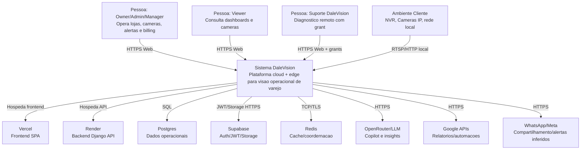

# C4 Contexto

Escala: 🟢 CONFIRMADO | 🟡 INFERIDO | 🔴 LACUNA

## Relacionamentos

| Origem | Destino | Protocolo | Descricao | Confianca |
|---|---|---|---|---|
| Browser | Frontend Vercel | HTTPS | SPA de operacao. | 🟢 CONFIRMADO |
| Frontend | Backend Django | HTTPS REST | APIs `/api/` e `/api/v1/`. | 🟢 CONFIRMADO |
| Edge Agent | Backend Django | HTTPS REST | Activation, heartbeat, camera health, update, events. | 🟢 CONFIRMADO |
| Edge Agent | NVR/Cameras | RTSP/HTTP | Captura e health local. | 🟢 CONFIRMADO |
| Backend | Postgres | SQL | Persistencia. | 🟢 CONFIRMADO |
| Backend/Frontend | Supabase | HTTPS/JWT | Auth/storage. | 🟢 CONFIRMADO |
| Backend | Redis | TCP/TLS | Cache/coordernacao. | 🟢 CONFIRMADO como config |
| Backend | LLM/Google/Meta | HTTPS | Copilot/relatorios/mensageria. | 🟡 INFERIDO |
