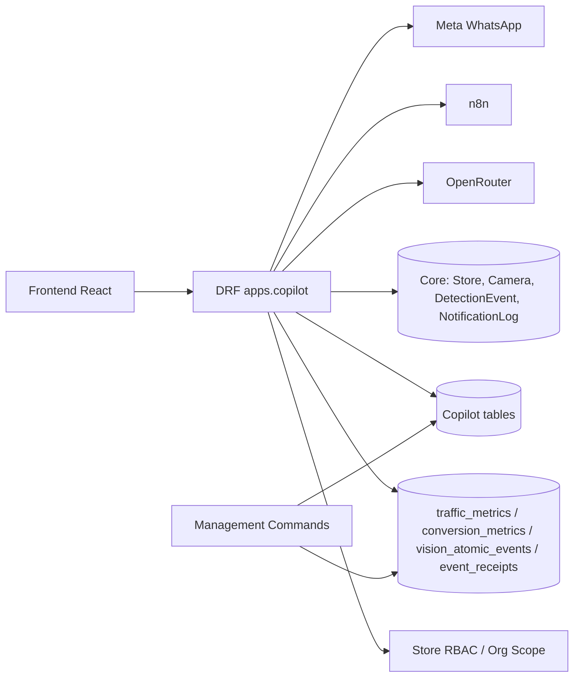

# Copilot - Design

## Visão Arquitetural

O Copilot é a camada de decisão operacional do DaleVision. Ele não coleta vídeo diretamente; consome métricas e eventos já projetados pelo backend e materializa contexto, insights, ações, outcomes e valor financeiro estimado. 🟢

A arquitetura combina endpoints síncronos DRF, jobs de materialização, tabelas de snapshot/outcome/ledger e integrações externas best-effort com OpenRouter, n8n e Meta WhatsApp. 🟢

## Componentes Principais

| Componente | Responsabilidade | Confiança |
|---|---|---|
| `CopilotDashboardContextSnapshot` | Cache materializado de contexto por loja | 🟢 |
| `CopilotOperationalInsight` | Insight ativo/arquivado com evidências e ações | 🟢 |
| `CopilotReport72h` | Relatório 72h com summary/sections/readiness | 🟢 |
| `CopilotConversation`/`CopilotMessage` | Histórico conversacional por loja, usuário e sessão | 🟢 |
| `StoreProfile` | Segmento, horários, defaults e preferências por loja | 🟢 |
| `OperationalWindowHourly` | Bucket operacional de 5/10 min | 🟢 |
| `ActionOutcome` | Ação despachada e seu resultado/impacto | 🟢 |
| `ValueLedgerDaily` | Consolidação diária de valor em risco/recuperado | 🟢 |
| `NetworkOperationalPolicy` | Thresholds e parâmetros de rede/loja | 🟢 |
| `services._core` | Materialização de contexto, janela, insight e relatório | 🟢 |
| `services.intelligence_feed` | Feed unificado multi-fonte | 🟢 |
| `views_intelligence_feed` | HTTP e ações do feed | 🟢 |
| `copilotService` frontend | Cliente TS centralizado | 🟢 |

## Rotas HTTP

Todas as rotas de `apps.copilot.urls` são montadas sob `/api/v1/`. 🟢

| Método | Rota | Autorização | Função | Confiança |
|---|---|---|---|---|
| GET | `/copilot/daily-briefing/` | autenticado, leitura se store_id | Briefing diário | 🟢 |
| GET | `/copilot/stores/<store_id>/context/` | leitura | Contexto de dashboard | 🟢 |
| GET | `/copilot/stores/<store_id>/insights/` | leitura | Insights por loja | 🟢 |
| GET | `/copilot/network/insights/` | org do usuário | Insights de rede | 🟢 |
| GET | `/copilot/stores/<store_id>/report-72h/` | leitura | Relatório 72h | 🟢 |
| GET/POST | `/copilot/stores/<store_id>/conversations/` | leitura | Conversa | 🟢 |
| POST | `/copilot/stores/<store_id>/actions/staff-plan/` | gestão | Atualizar plano de staff | 🟢 |
| GET/POST | `/copilot/stores/<store_id>/actions/outcomes/` | leitura/gestão | Outcomes por loja | 🟢 |
| PATCH | `/copilot/stores/<store_id>/actions/outcomes/<outcome_id>/` | gestão | Atualizar outcome | 🟢 |
| GET | `/copilot/stores/<store_id>/value-ledger/daily/` | leitura | Ledger por loja | 🟢 |
| GET | `/copilot/network/actions/outcomes/` | org/interno | Outcomes de rede | 🟢 |
| GET | `/copilot/network/value-ledger/daily/` | org/interno | Ledger de rede | 🟢 |
| GET | `/copilot/network/efficiency-ranking/` | org/interno | Ranking de eficiência | 🟢 |
| GET/PATCH/PUT | `/copilot/stores/<store_id>/profile/` | leitura/gestão | Perfil de loja | 🟢 |
| GET/POST | `/copilot/network/policies/` | org do usuário | Policy operacional | 🟢 |
| GET | `/dashboard/intelligence-feed/` | org/interno, leitura se store | Feed unificado | 🟢 |
| POST | `/dashboard/intelligence-feed/<feed_item_id>/actions/` | gestão | Ação no feed | 🟢 |
| GET/POST | `/webhooks/whatsapp/meta/` | verificação/token Meta | Webhook WhatsApp | 🟢 |

Rotas chamadas pelo frontend, mas não encontradas no `urls.py`: `/copilot/stores/<store_id>/conversation-assets/`. 🔴

## Modelo de Dados

### Contexto e Insights

`CopilotDashboardContextSnapshot` armazena `snapshot_json`, `account_state`, `operational_state` e `generated_at`, com índices por loja/org decrescentes por geração. 🟢

`CopilotOperationalInsight` armazena categoria, severidade, headline, descrição, evidências JSON, ações JSON, confiança, status, janela fonte e expiração. 🟢

`CopilotReport72h` armazena status `pending|ready|failed`, summary JSON, sections JSON e janela fonte. 🟢

### Conversa

`CopilotConversation` é indexado por loja, usuário e sessão. 🟢

`CopilotMessage` grava `role`, `content`, metadata, contexto, citações e `created_at`. 🟢

### Operação, Ação e Valor

`OperationalWindowHourly` consolida métricas por bucket único `(store_id, ts_bucket, window_minutes)`. 🟢

`ActionOutcome` representa uma intervenção despachada, com status, status de resultado, baseline, outcome, impacto esperado/realizado, entrega e timestamps. 🟢

`ValueLedgerDaily` consolida por loja e data, com valor recuperado, valor em risco, ações, confiança média e `method_version`. 🟢

### Configuração

`StoreProfile` define modelo de negócio, presença de salão/POS, horários, timezone e defaults. 🟢

`NetworkOperationalPolicy` define ticket médio, custo/hora, thresholds de fila/inatividade/conversão e flag de WhatsApp. 🟢

## Fluxos de Materialização

`build_dashboard_context_payload` combina assinatura/trial, heartbeat edge, câmeras, perfil, defaults de segmento e métricas de 24h. 🟢

`get_latest_context_snapshot` considera snapshot válido por 300 segundos. 🟢

`build_operational_window_payload` escolhe janela de 5 ou 10 minutos, consulta `traffic_metrics`, `conversion_metrics`, `detection_events`, `vision_atomic_events`, calcula confiança e risco financeiro estimado. 🟢

A confiança usa fórmula `0.5*camera_ratio + 0.25*freshness + 0.25*event_density`. 🟢

`build_insight_candidates` gera insights para edge offline, câmeras offline, fila >= 300s, conversão < 12%, queda de fluxo >= 30% e alertas abertos. 🟢

`materialize_operational_insights` arquiva ativos anteriores e cria novos candidatos. 🟢

## Fluxo Conversacional

1. Usuário envia mensagem ao endpoint de conversa. 🟢
2. Backend valida loja e papel de leitura. 🟢
3. Backend cria/obtém conversa por `store_id`, `user_uuid`, `session_id`. 🟢
4. Backend grava mensagem user. 🟢
5. Backend tenta OpenRouter se houver API key. 🟢
6. Em falha ou sem chave, usa resposta determinística. 🟢
7. Backend grava mensagem assistant e retorna ambas. 🟢

Lacuna: metadata da mensagem assistant sempre indica `mode=deterministic`, mesmo se resposta vier do LLM. 🟡

## Intelligence Feed

O service busca até 200 itens por fonte em janela padrão de 24h. 🟢

Fontes consolidadas: `DetectionEvent`, `CopilotOperationalInsight`, `ActionOutcome` e `NotificationLog` para enriquecimento. 🟢

Pipeline: fetch, mapear, enriquecer store_name, enriquecer notification logs, aplicar prioridade, deduplicar, filtrar scope/status, ordenar, paginar e remover `evidence` se solicitado. 🟢

IDs de feed usam prefixos: `de_` para detection event, `ci_` para insight, `ao_` para action outcome. 🟢

## Ações e Value Ledger

Outcomes podem ser criados manualmente, via feed action, comandos MVP, callback ou atualização direta. 🟢

Toda alteração relevante deve sincronizar o ledger diário com `_sync_value_ledger_from_outcome`. 🟢

O status de valor é classificado como `official`, `validated` ou `estimated` conforme confiança, ações concluídas e recovery rate. 🟢

A saúde do ledger usa SLO de 900 segundos para freshness. 🟢

## Integrações Externas

### OpenRouter

Endpoint externo: `https://openrouter.ai/api/v1/chat/completions`. 🟢

Configurações: `OPENROUTER_API_KEY`, `OPENROUTER_COPILOT_MODEL`, `OPENROUTER_TIMEOUT_SECONDS`. 🟢

Modelo default em settings: `google/gemma-3-27b-it:free`. 🟢

### n8n

Ações de feed disparam `dashboard_feed_action_dispatched` via `send_event_to_n8n` em best-effort. 🟢

Callback de ActionOutcome aceita token de serviço, mas a rota não foi encontrada no `urls.py`. 🔴

### WhatsApp Meta

`WhatsAppMetaWebhookView` trata verificação GET e POST de eventos/interações. 🟢

`WhatsAppMetaDispatcher` envia mensagens interativas via Meta Cloud com timeout de 5s. 🟢

## Diagrama C4 Simplificado

## Riscos Técnicos

| Risco | Consequência | Mitigação | Confiança |
|---|---|---|---|
- 🟢 DECIDIDO: Rota de callback (`ActionOutcome/callback`) deve ser registrada no `urls.py` como Task Obrigatória para fechar o ciclo de valor.
- 🟢 DECIDIDO: Chamadas de frontend para `conversation-assets` (anexos/áudio) serão removidas no MVP para focar em texto/links e evitar erros 404.
- 🟢 RESOLVIDO: O comando `sync_operational_insights.py` deve ser atualizado para o novo path do modelo `StoreProfile` em `apps.copilot.models`.
| Política sem RBAC por loja | Alteração indevida dentro da org | Aplicar `require_store_role` quando `store_id` específico | 🟡 |
| Fallback vazio no feed esconde falhas | Erro operacional pode parecer ausência de eventos | Manter log e adicionar métrica/alerta de erro | 🟡 |
| LLM síncrono na request | Latência de conversa | Timeout configurável e fallback já mitigam parcialmente | 🟢 |
