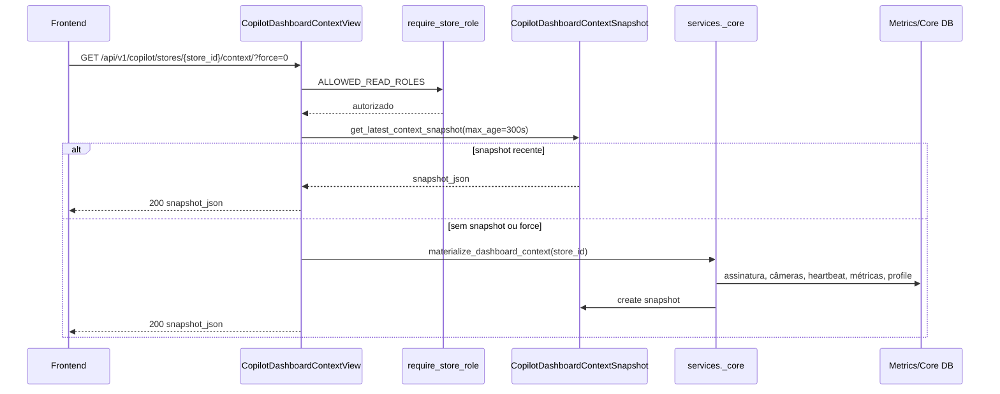
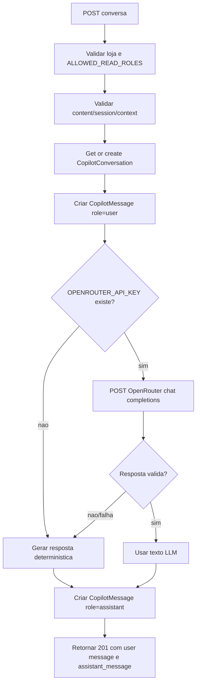
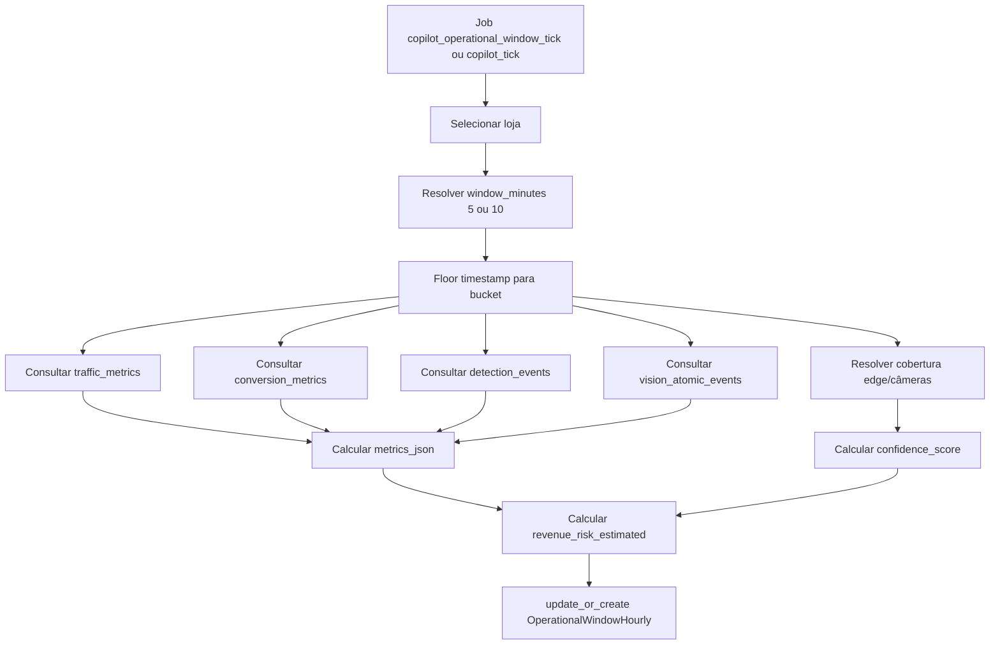
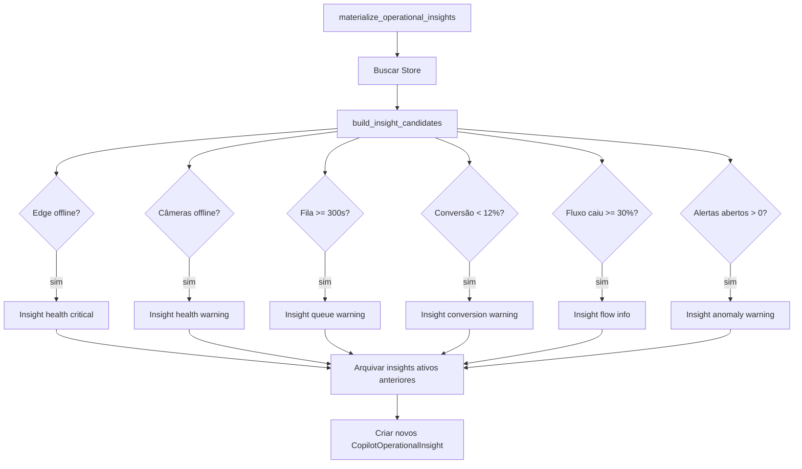
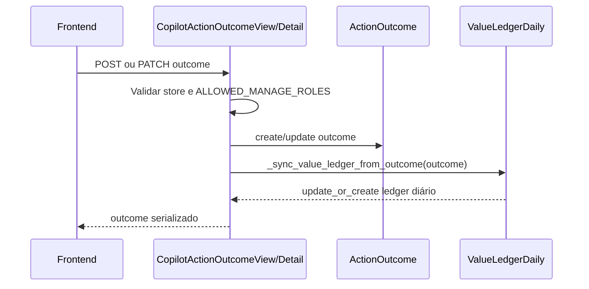
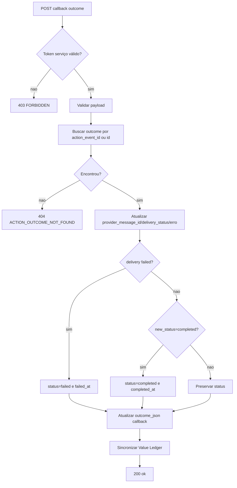
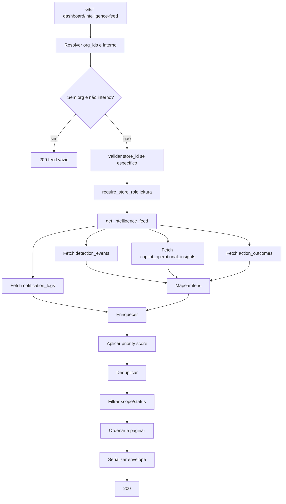
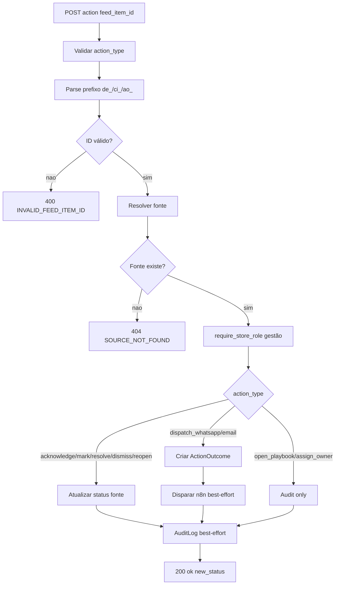
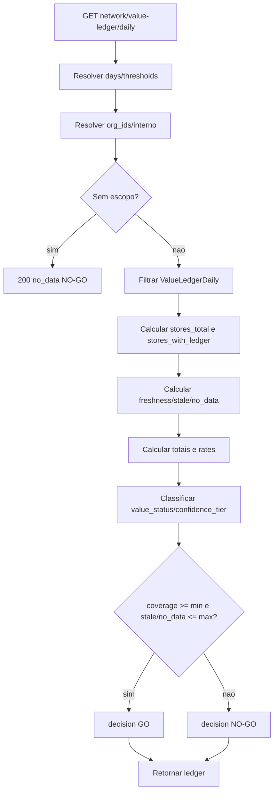
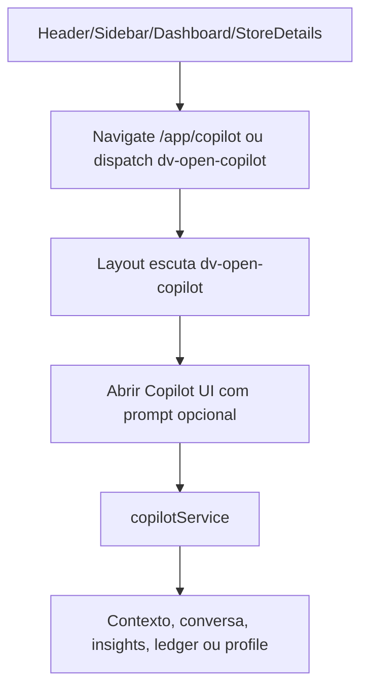

# Copilot - Flows

## Fluxo 1 - Contexto de dashboard por loja

Confiança: 🟢 confirmado em `CopilotDashboardContextView` e `services._core`.

## Fluxo 2 - Conversa com LLM e fallback

Confiança: 🟢 confirmado em `_build_copilot_assistant_reply` e `CopilotConversationView`.

Lacuna: metadata da resposta indica `mode=deterministic` mesmo quando LLM pode ter sido usado. 🟡

## Fluxo 3 - Materialização de janela operacional

Confiança: 🟢 confirmado em `build_operational_window_payload` e comando `copilot_operational_window_tick`.

## Fluxo 4 - Geração de insights operacionais

Confiança: 🟢 confirmado em `services._core`.

## Fluxo 5 - ActionOutcome e Value Ledger

Confiança: 🟢 confirmado em views de outcome.

## Fluxo 6 - Callback externo de entrega/conclusão

Confiança: 🟢 confirmado em `CopilotActionOutcomeCallbackView`.

Lacuna: rota não encontrada em `urls.py`. 🔴

## Fluxo 7 - Intelligence Feed

Confiança: 🟢 confirmado em `views_intelligence_feed.py` e `services.intelligence_feed.py`.

## Fluxo 8 - Ação no Intelligence Feed

Confiança: 🟢 confirmado em `IntelligenceFeedActionView`.

## Fluxo 9 - Value Ledger de rede e GO/NO-GO

Confiança: 🟢 confirmado em `CopilotNetworkValueLedgerDailyView`.

## Fluxo 10 - Frontend abre Copilot

Confiança: 🟢 confirmado por rotas em `App.tsx`, `Layout.tsx`, `Header.tsx`, `StoreDetails.tsx` e `copilotService`.

## Estados Principais

| Entidade | Estados | Confiança |
|---|---|---|
| Insight | `active`, `archived` | 🟢 |
| Report 72h | `pending`, `ready`, `failed` | 🟢 |
| Message role | `system`, `assistant`, `user` | 🟢 |
| ActionOutcome status | `dispatched`, `completed`, `failed`, `canceled` | 🟢 |
| Outcome result | `resolved`, `partial`, `not_resolved` | 🟢 |
| Value status | `official`, `validated`, `estimated` | 🟢 |
| Feed item type | `live_event`, `ai_insight`, `action_status`, `resolved_outcome` | 🟢 |
| Feed status | `new`, `acknowledged`, `dispatched`, `delivered`, `in_progress`, `resolved`, `failed`, `expired`, `dismissed` | 🟢 |

## Códigos de Erro Relevantes

| Código | Quando | Confiança |
|---|---|---|
| `STORE_NOT_FOUND` | Loja ausente em contexto/report/conversa/outcomes/profile | 🟢 |
| `ACTION_OUTCOME_NOT_FOUND` | Outcome ausente em PATCH/callback | 🟢 |
| `FORBIDDEN` | Token de serviço inválido no callback | 🟢 |
| `INVALID_STORE_ID` | `store_id` inválido no Intelligence Feed | 🟢 |
| `INVALID_FEED_ITEM_ID` | ID de feed não parseável | 🟢 |
| `SOURCE_NOT_FOUND` | Fonte do feed não encontrada | 🟢 |
| `ACTION_FAILED` | Exceção ao executar ação do feed | 🟢 |

## Pontos de Controle

1. Preservar rotas `/api/v1/copilot/*` e `/api/v1/dashboard/intelligence-feed/*`. 🟢
2. Preservar RBAC de leitura/gestão por loja. 🟢
3. Preservar fallback determinístico do Copilot. 🟢
4. Preservar sincronização do Value Ledger após outcome. 🟢
5. Corrigir lacunas de rotas ausentes antes de depender de assets/callback em produção. 🔴
