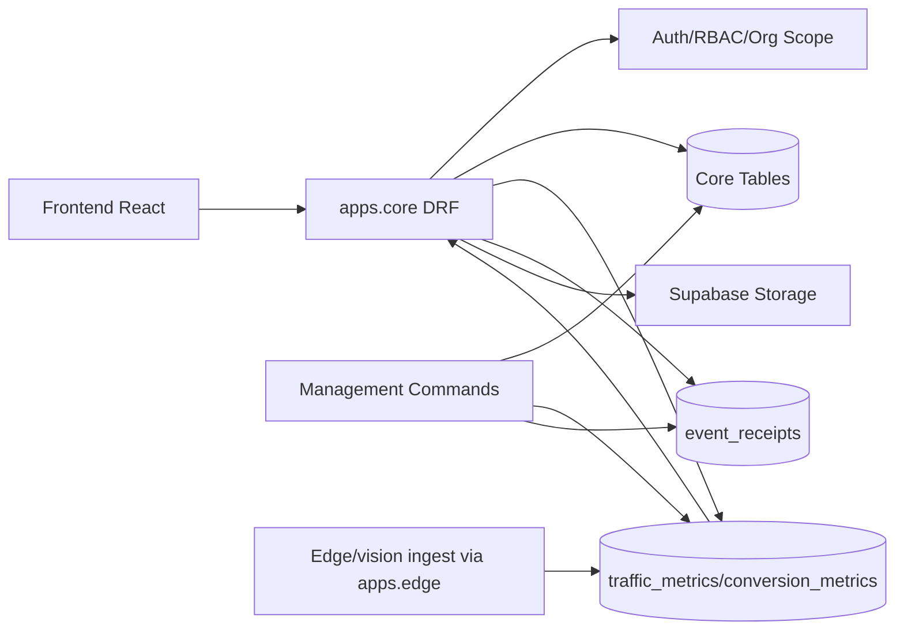

# Core - Design

## Visão Arquitetural

`apps.core` é o núcleo operacional do backend Django. Ele funciona como camada de compatibilidade sobre o schema Supabase/Postgres e como agregador de funcionalidades transversais: onboarding, relatórios, PDV, calibração, storage e observabilidade. 🟢

Grande parte dos modelos é `managed=False`; isso indica que o Django não é a única fonte de verdade do schema. 🟢

## Componentes

| Componente | Responsabilidade | Confiança |
|---|---|---|
| `models.py` | Entidades centrais e modelos gerenciados novos | 🟢 |
| `views_onboarding.py` | Jornada de setup/ativação da loja | 🟢 |
| `views_report.py` | Relatórios operacionais e funil | 🟢 |
| `views_calibration.py` | Workflow de calibração e evidências | 🟢 |
| `views.py` | Sales, PDV, storage, data quality, admin observability | 🟢 |
| `services/event_receipts.py` | Idempotência e status de recibos | 🟢 |
| `services/journey_events.py` | Eventos de jornada com contrato | 🟢 |
| `services/onboarding_progress.py` | Progresso inferido e persistido | 🟢 |
| `services/pdv_health.py` | Saúde de ingestão PDV via receipts | 🟢 |
| `services/storage.py` | Supabase Storage signed URLs | 🟢 |

## Rotas

Todas as rotas de `apps.core.urls` entram sob `/api/v1/`. 🟢

### Onboarding

| Método | Rota | Função | Confiança |
|---|---|---|---|
| GET | `/onboarding/progress/` | Progresso por steps | 🟢 |
| POST | `/onboarding/step/complete/` | Marca step completo | 🟢 |
| GET | `/onboarding/next-step/` | Próxima ação recomendada | 🟢 |
| GET/POST | `/onboarding/setup-session/` | Sessão multi-stage | 🟢 |
| GET | `/onboarding/indicator-catalog/` | Indicadores/ROIs sugeridos | 🟢 |
| POST | `/onboarding/roi/publish/` | Publica ROI/config | 🟢 |
| POST | `/onboarding/complete/` | Conclui onboarding | 🟢 |
| POST | `/onboarding/lgpd-acceptance/` | Registra aceite LGPD | 🟢 |

### Relatórios e produtividade

| Método | Rota | Função | Confiança |
|---|---|---|---|
| GET | `/report/summary/` | Sumário operacional | 🟢 |
| GET | `/report/impact/` | Impacto financeiro/operacional | 🟢 |
| GET | `/productivity/coverage/` | Cobertura produtiva | 🟢 |
| GET | `/productivity/coverage` | Compat sem slash | 🟢 |
| GET | `/report/journey-funnel/` | Funil de jornada | 🟢 |
| GET | `/report/export/` | Export CSV/PDF-like blob | 🟢 |

### Sales, PDV e data quality

| Método | Rota | Função | Confiança |
|---|---|---|---|
| GET/POST | `/sales/progress/` | Meta e progresso de receita | 🟢 |
| POST | `/integration/pdv/interest/` | Interesse em integração PDV | 🟢 |
| POST | `/integration/pdv/events/` | Ingestão de transações PDV | 🟢 |
| GET | `/integration/pdv/summary/` | Sumário PDV | 🟢 |
| GET | `/integration/pdv/ingestion-health/` | Saúde PDV | 🟢 |
| GET | `/data-quality/completeness/` | Completude de dados | 🟢 |

### Calibração e storage

| Método | Rota | Função | Confiança |
|---|---|---|---|
| GET/POST | `/calibration/actions/` | Lista/cria ações | 🟢 |
| POST | `/calibration/actions/auto-generate/` | Auto-geração | 🟢 |
| GET | `/calibration/actions/impact-summary/` | Impacto agregado | 🟢 |
| PATCH | `/calibration/actions/<action_id>/` | Atualiza status/prioridade | 🟢 |
| GET | `/calibration/actions/<action_id>/evidences/` | Lista evidências | 🟢 |
| POST | `/calibration/actions/<action_id>/evidence/` | Cria evidência | 🟢 |
| POST | `/calibration/actions/<action_id>/result/` | Cria resultado | 🟢 |
| GET | `/system/storage-status/` | Status storage | 🟢 |
| GET | `/system/storage/sign/` | Signed URL | 🟢 |

### Admin observability

Rotas confirmadas: ingestion funnel gap, pipeline observability, release gate, CV quality baseline e HV event health. 🟢

Todas exigem autenticação e checagem interna staff/superuser. 🟢

## Modelo de Dados

### Unmanaged legado

Organizações, lojas, câmeras, eventos, regras, notificações, billing e audit logs são unmanaged e apontam para tabelas públicas existentes. 🟢

Essa escolha preserva compatibilidade, mas exige cuidado em migrations e mudanças diretas no banco. 🟢

### Managed novo

LGPD, suporte, calibração, qualidade de câmera, inferência de role, metas de vendas, interesse PDV e transações PDV são gerenciados pelo Django. 🟢

Esses modelos têm índices e constraints específicas, como unique de meta mensal por usuário e unique de transação por loja/source/transaction. 🟢

## Serviços

### Event Receipts

`insert_event_receipt_if_new` insere receipt idempotente. 🟢

`mark_event_receipt_processed` e `mark_event_receipt_failed` atualizam status de processamento por `event_id`. 🟢

### Journey Events

`log_journey_event` valida campos obrigatórios, registra rejeições de contrato em `event_receipts` e cria `JourneyEvent`. 🟢

Contrato identificado: `journey_event_contract_v1_2026-03-20`. 🟢

### Onboarding Progress

O serviço combina estado persistido com inferência baseada em edge, câmera, ROI, métricas e insights. 🟢

O frontend consome steps fixos e trata next-step inválido/404 como fallback nulo. 🟢

### Storage

Supabase Storage depende de URL e service role key; quando ausente, loga warning e retorna indisponível. 🟢

## Fluxos de Dados

### PDV

Frontend ou integração envia transação para `/integration/pdv/events/`; backend valida loja, persiste `PosTransactionEvent`, gera receipt idempotente e relatórios/sales progress passam a usar os dados. 🟢

### Onboarding

Frontend usa `onboardingService` para consultar progresso, atualizar setup session, publicar ROI, concluir onboarding e registrar LGPD. 🟢

### Relatórios

`views_report.py` usa SQL direto sobre `traffic_metrics`, `conversion_metrics`, `operational_window_hourly`, `journey_events` e outras tabelas para montar payloads agregados. 🟢

### Calibração

Admin ou usuário autorizado lista/cria ações; evidências podem usar signed URLs; resultados validam se a ação passou; auto-generate cria ações a partir de sinais de qualidade. 🟢

## Integração Frontend

`onboardingService` consome todos os endpoints de onboarding. 🟢

`meService` consome summary, impact, productivity coverage, journey funnel e export, com fallbacks de resiliência. 🟢

`salesService` consome sales progress com fallback `not_configured`. 🟢

`adminService` consome calibração e observabilidade admin. 🟢

## Diagrama

## Riscos e Trade-offs

| Tema | Decisão | Trade-off | Confiança |
|---|---|---|---|
| Schema legado | Modelos unmanaged | Compatível, mas frágil a drift de banco | 🟢 |
| Relatórios | SQL direto | Flexível e rápido, mas pouco protegido por ORM | 🟢 |
| Core amplo | Muitas responsabilidades | Simples de integrar, difícil de evoluir | 🟢 |
| Frontend fallback | UX resiliente | Pode mascarar indisponibilidade real | 🟢 |
| Calibração | Workflow em core | Próximo dos modelos, mas mistura domínio CV/admin | 🟡 |
