# Core - Flows

## Fluxo 1 - Onboarding setup session

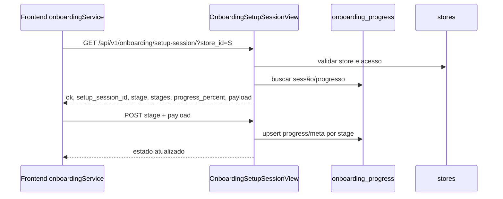

Confiança: 🟢 confirmado em `views_onboarding.py` e `frontend/src/services/onboarding.ts`.

## Fluxo 2 - Próximo passo de onboarding

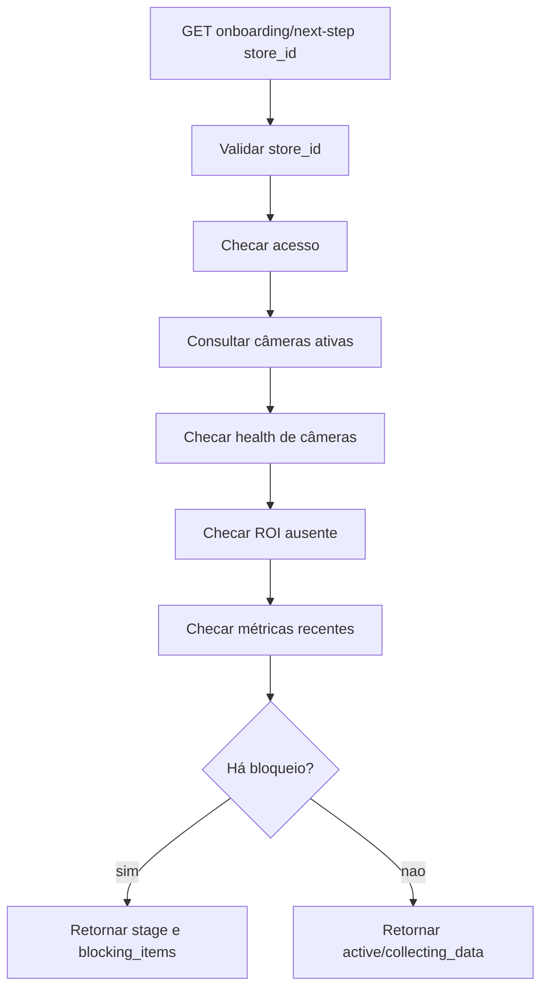

Confiança: 🟢 confirmado pelos helpers `_has_unvalidated_cameras`, `_has_missing_roi`, `_has_recent_metrics` e `_build_completion_blocker`.

## Fluxo 3 - Publicação ROI no onboarding

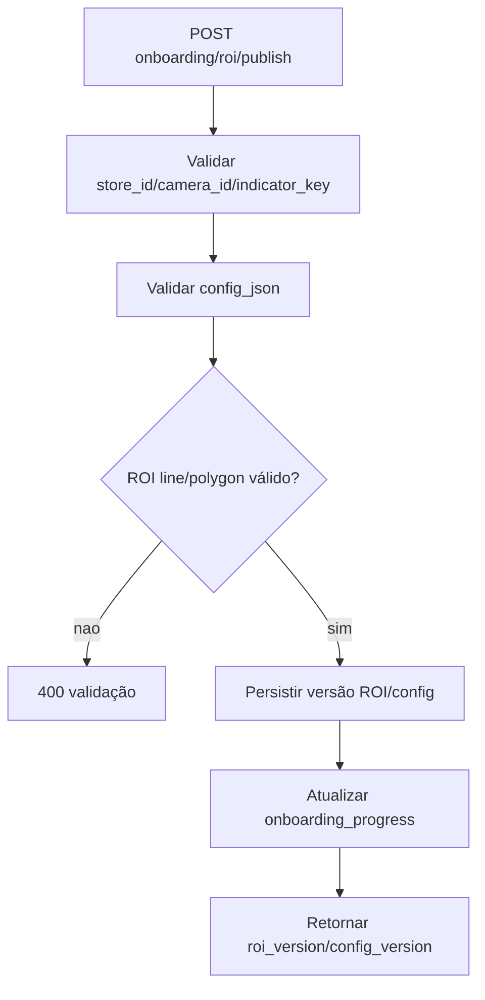

Confiança: 🟢 confirmado em `OnboardingRoiPublishView` e helpers de shape.

## Fluxo 4 - Conclusão do onboarding

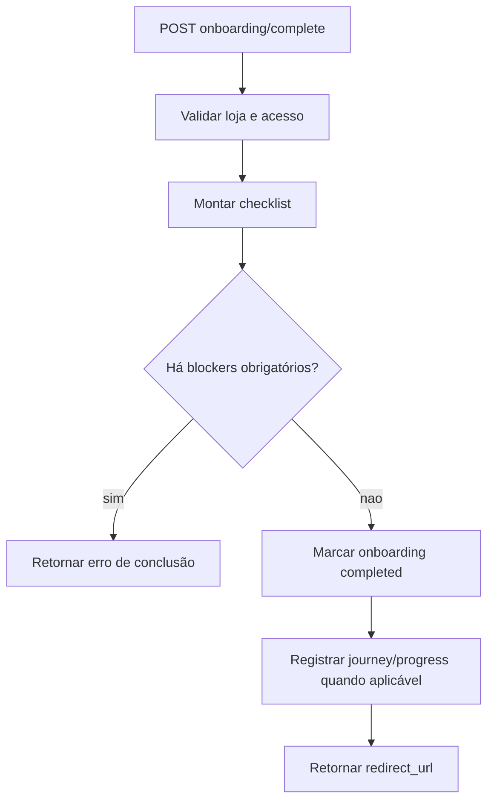

Confiança: 🟢 confirmado em `OnboardingCompleteView`.

## Fluxo 5 - Journey event com receipt

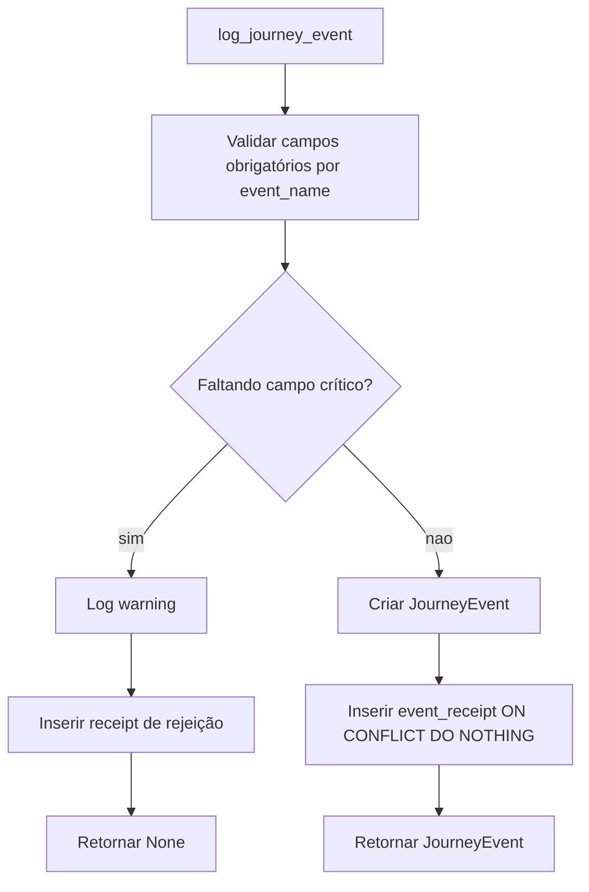

Confiança: 🟢 confirmado em `services/journey_events.py`.

## Fluxo 6 - Ingestão PDV

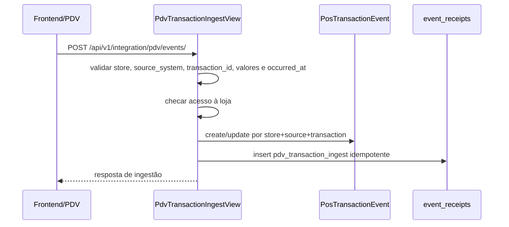

Confiança: 🟢 confirmado em `views.py`, `models.py` e `services/event_receipts.py`.

## Fluxo 7 - Report summary/impact/produtividade

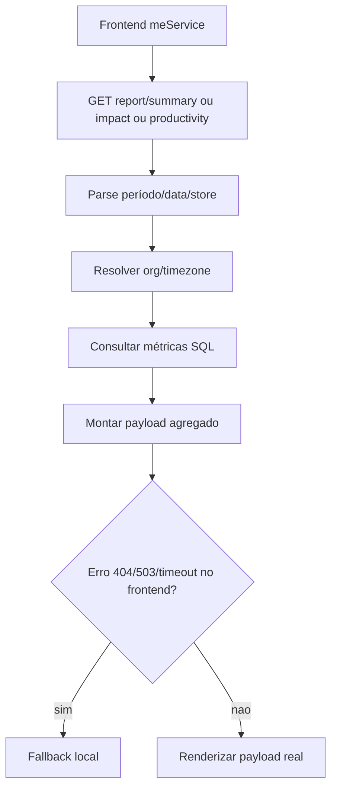

Confiança: 🟢 confirmado em `views_report.py` e `frontend/src/services/me.ts`.

## Fluxo 8 - Calibração

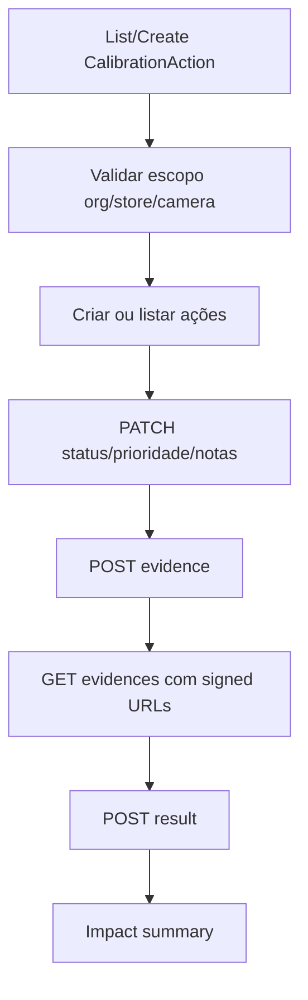

Confiança: 🟢 confirmado em `views_calibration.py` e `adminService`.

## Fluxo 9 - Auto-geração de calibração

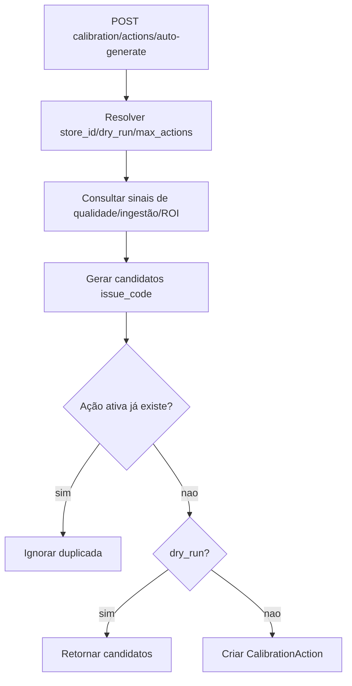

Confiança: 🟢 confirmado em `CalibrationActionAutoGenerateView` e helper `_has_active_action`.

## Fluxo 10 - Storage signed URL

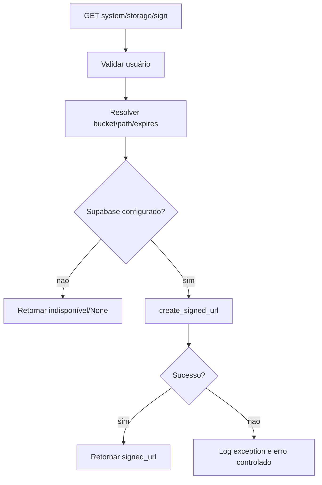

Confiança: 🟢 confirmado em `services/storage.py` e `SnapshotSignedUrlView`.

## Fluxo 11 - Admin observability

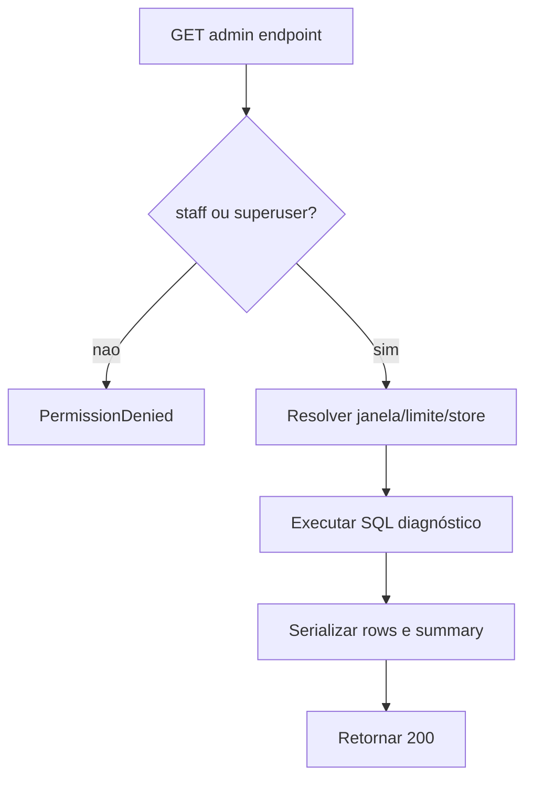

Confiança: 🟢 confirmado em views admin de `views.py`.

## Fluxo 12 - Jobs core

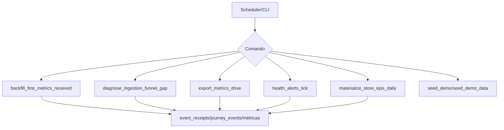

Confiança: 🟢 confirmado em `management/commands`.

## Estados Principais

| Domínio | Estados | Confiança |
|---|---|---|
| Store | `active`, `inactive`, `trial`, `blocked` | 🟢 |
| Camera | `online`, `degraded`, `offline`, `unknown`, `error` | 🟢 |
| DetectionEvent | `open`, `resolved`, `ignored` | 🟢 |
| Onboarding frontend | `no_store`, `add_cameras`, `validate_cameras`, `setup_roi`, `collecting_data`, `active` | 🟢 |
| CalibrationAction | `open`, `in_progress`, `waiting_validation`, `validated`, `rejected`, `closed` | 🟢 |
| SupportAccessRequest | `pending`, `granted`, `closed`, `rejected` | 🟢 |
| Subscription | `trialing`, `active`, `past_due`, `canceled`, `incomplete`, `blocked` | 🟢 |

## Pontos de Controle

1. Preservar `managed=False` onde o schema é externo. 🟢
2. Preservar rotas `/api/v1/*` consumidas pelo frontend. 🟢
3. Preservar fallbacks frontend para relatórios/sales. 🟢
4. Preservar idempotência de receipts e PDV. 🟢
5. Auditar drift de SQL direto contra schema real. 🟡
