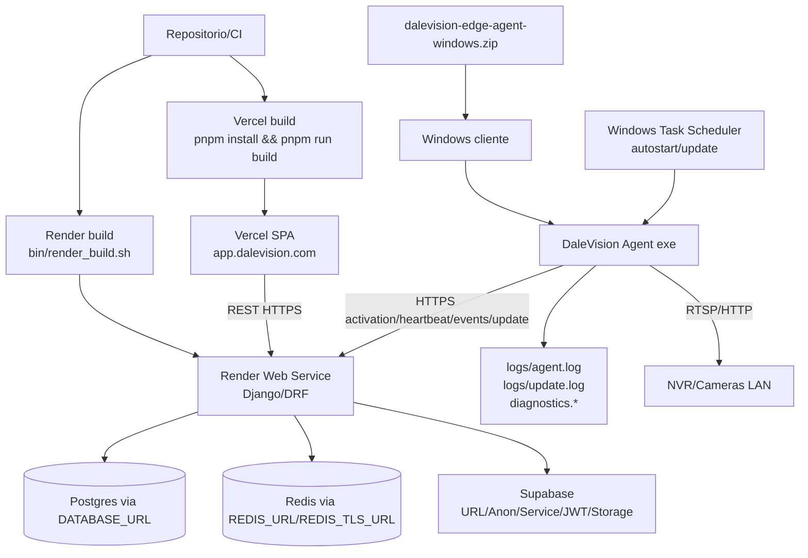

# Deployment e Infraestrutura

Escala: 🟢 CONFIRMADO | 🟡 INFERIDO | 🔴 LACUNA



## Backend Cloud

🟢 CONFIRMADO: O backend usa Django/DRF e build em Render via `bin/render_build.sh`, que valida `DATABASE_URL`, `SUPABASE_URL` e `SUPABASE_ANON_KEY`. `settings.py` configura Postgres, Redis, Supabase, WhiteNoise, DRF e CORS.

## Frontend Cloud

🟢 CONFIRMADO: O frontend usa Vercel com `rootDirectory` de frontend, build `pnpm install` e `pnpm run build`, output `dist`, redirects para `app.dalevision.com` e rewrite SPA.

## Edge Windows

🟢 CONFIRMADO: O release Windows e distribuido como `dalevision-edge-agent-windows.zip`, com executavel, `Start_DaleVision_Agent.bat/.ps1`, tarefas de autostart/update e logs locais.

```powershell
python -m dalevision_edge_agent.main
python -m dalevision_edge_agent.main doctor --nvr-ip <IP_DO_NVR> --share
.\scripts\release_windows.ps1 -Version vX.Y.Z
```

## Variaveis Criticas

| Variavel | Uso |
|---|---|
| `DATABASE_URL` | Banco principal. |
| `SUPABASE_URL`, `SUPABASE_KEY`, `SUPABASE_ANON_KEY` | Supabase auth/storage. |
| `SUPABASE_JWT_SECRET`, `SUPABASE_SERVICE_ROLE_KEY` | Validacao/admin Supabase. |
| `REDIS_URL`, `REDIS_TLS_URL` | Redis. |
| `EDGE_RELEASE_*` | Stable/canary/min supported/setup URL. |
| `EDGE_ACTIVATION_TOKEN_TTL_SECONDS` | TTL de ativacao. |
| `EDGE_DOWNLOAD_LINK_TTL_SECONDS` | TTL de download assinado. |

🔴 LACUNA/RISCO: Revisar `CORS_ALLOW_ALL_ORIGINS = True` antes de endurecer producao.
