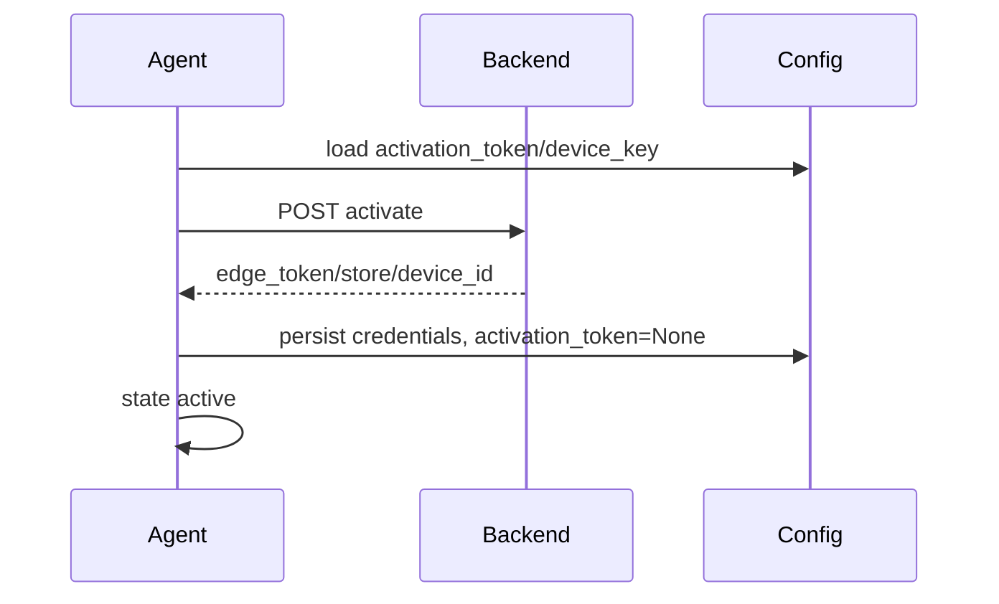

# Ativar Agente, Design Técnico

## Fluxo

## Interface

| Campo | Direção | Confiança |
|---|---|---|
| `activation_token` | agente -> backend | 🟢 |
| `device_key` | agente -> backend/backend -> agente | 🟢 |
| `installed_version` | agente -> backend | 🟢 |
| `update_channel` | agente -> backend/backend -> agente | 🟢 |
| `edge_token` | backend -> agente | 🟢 |
| `device_id` | backend -> agente | 🟢 |

## Erros

- 🟢 Rede: retry em `activating`.
- 🟢 401/403/409: `error`.
- 🟡 Payload incompleto em 2xx: exigir validação adicional na reimplementação.
