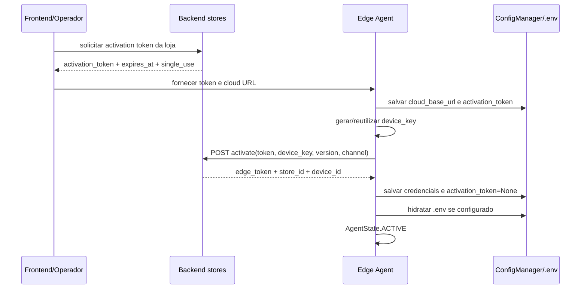

# Edge Agent Activation, Design Técnico

## Interface

### Backend

| Método | Caminho | Entrada | Saída | Status | Confiança |
|---|---|---|---|---|---|
| POST | endpoint de emissão por loja em `stores` | usuário autenticado, `store_id` | `activation_token`, `expires_at`, `single_use` | 201, 403 | 🟢 |
| POST | endpoint público de ativação em `stores` | `activation_token`, `device_key`, `installed_version`, `update_channel` | `store_id`, `device_key`, `device_id`, `update_channel`, `edge_token` | 200, erro do service | 🟢 |

### Agente

| Símbolo | Entrada | Retorno | Confiança |
|---|---|---|---|
| `ActivationClient.activate` | token, device_key, installed_version, update_channel | `ActivationResult` | 🟢 |
| `bootstrap_activation` | logger, cloud_base_url, installed_version, activation_token | `ActivationBootstrapOutcome` | 🟢 |
| `hydrate_runtime_env_from_activation_config` | logger, config, env_path opcional | `bool` | 🟢 |
| `ConfigManager.update_partial` | campos parciais | config atualizada | 🟢 |

## Fluxo Principal

## Fluxos Alternativos

- 🟢 **Device já provisionado:** se config contém `device_key` e `edge_device_id`, retorna `active` sem chamar backend.
- 🟢 **Token ausente:** estado `unprovisioned`; log informa falta de activation token.
- 🟢 **Cloud ausente:** estado `error`; ativação inicial não prossegue.
- 🟢 **Erro de rede:** `ActivationResult` com `network_error=True`; estado `activating`.
- 🟢 **401/403/409:** estado `error`; erro não recuperável sem intervenção.
- 🟢 **Resposta não JSON:** payload vira `{}` e erro é preservado por status/código.

## Estado Interno

| Campo | Origem | Persistência | Confiança |
|---|---|---|---|
| `activation_token` | Operador/backend | Config local até sucesso | 🟢 |
| `device_key` | Config ou `_generate_device_key()` | Config local | 🟢 |
| `edge_device_id` | Backend | Config local | 🟢 |
| `edge_token` | Backend | Config local e `.env` | 🟢 |
| `store_id` | Backend | Config local e `.env` | 🟢 |
| `update_channel` | Config/backend, padrão `stable` | Config local | 🟢 |
| `installed_version` | Runtime | Config local | 🟢 |

## Decisões de Design

| Decisão | Evidência | Confiança |
|---|---|---|
| Token temporário troca por credencial de runtime, não expõe edge token no wizard. | ADR-0002 | 🟢 |
| Device já provisionado não reativa. | `bootstrap_activation` `has_device` | 🟢 |
| Rede é retryable; auth/conflito é erro. | `bootstrap_activation` status handling | 🟢 |
| Edge token explícito vence Authorization em endpoints edge. | `apps/edge/auth.py` | 🟢 |
| Tokens em log são mascarados ou representados por tamanho. | `activation.py`, `edge/auth.py` | 🟢 |

## Observabilidade

- 🟢 Logs `[ACTIVATION]` registram estado e erros de ativação.
- 🟢 Erros trazem `status_code`, `error_code`, `error_detail`.
- 🟢 Token bruto não aparece em log; backend usa `_mask_token`.

## Riscos e Lacunas

- 🟢 DECIDIDO: Mapear códigos de erro específicos para o usuário: `token_revoked`, `token_expired`, `network_error`, `device_already_activated` para evitar stalls no setup.
- 🟢 CONFIRMADO: Expiração ou revogação do token de ativação deve exibir feedback imediato e claro no frontend do instalador.
- 🟡 O service de ativação backend não foi expandido linha a linha nesta fase, mas a view e state machine confirmam o contrato.
