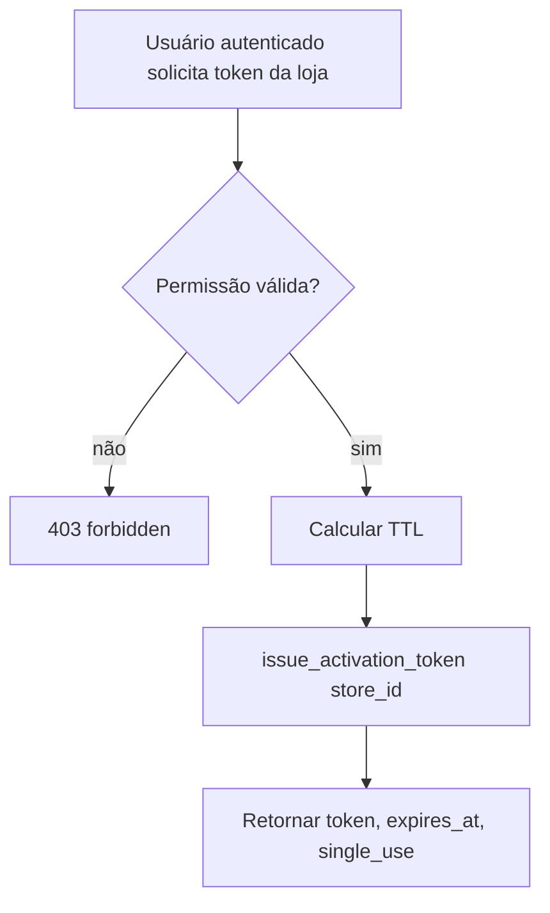
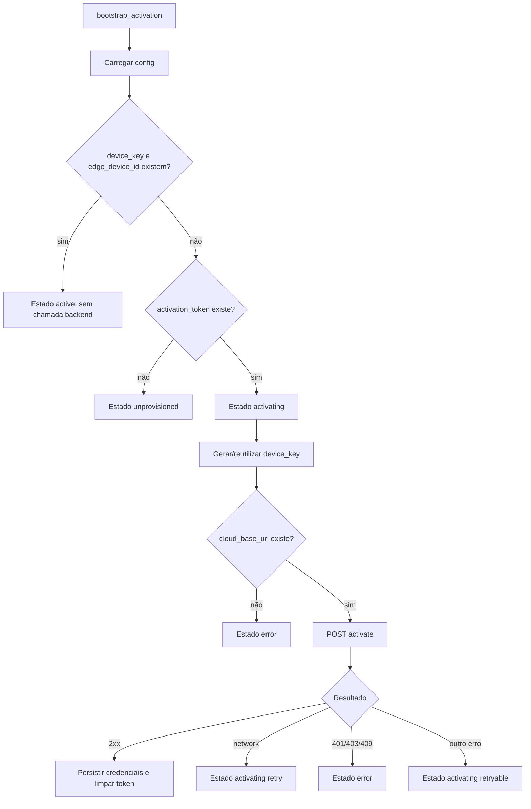
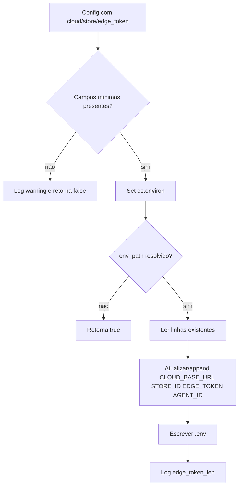
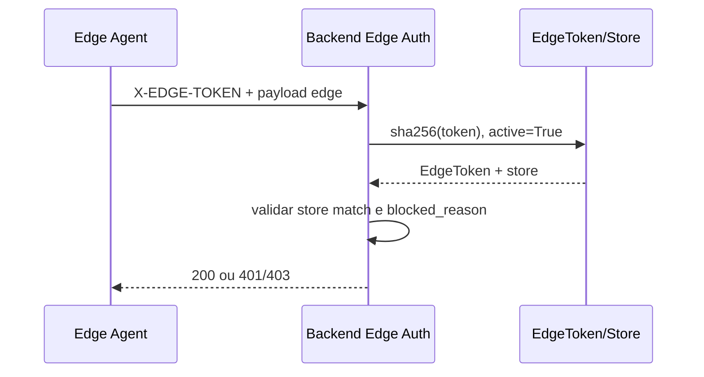

# Edge Agent Activation, Fluxos

## Fluxo 1, Emissão de Token

## Fluxo 2, Bootstrap Local

## Fluxo 3, Hidratação de Env

## Fluxo 4, Uso Posterior do Edge Token

## Lacunas

- 🔴 Detalhar todos os códigos de erro retornados por `activate_edge_device`.
