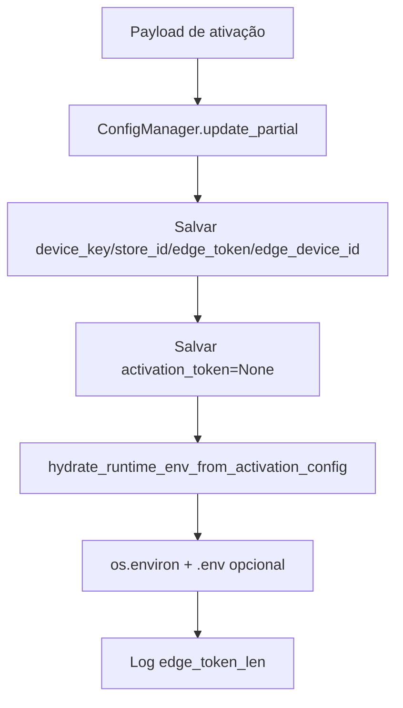

# Persistir Credenciais, Design Técnico

## Fluxo

## Campos

| Campo | Destino | Confiança |
|---|---|---|
| `edge_token` | config, env, `.env` | 🟢 |
| `store_id` | config, env, `.env` | 🟢 |
| `agent_id` | env/`.env` quando presente | 🟢 |
| `device_key` | config | 🟢 |
| `edge_device_id` | config | 🟢 |
| `activation_token` | config como `None` | 🟢 |

## Segurança

- 🟢 O valor do token pode ser persistido localmente porque é necessário para runtime.
- 🟢 O valor do token não pode ser logado.
- 🔴 Confirmar proteção ACL final do arquivo local no Windows.
