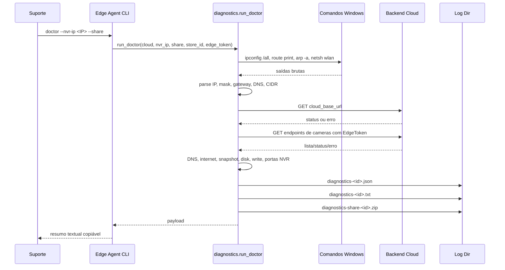
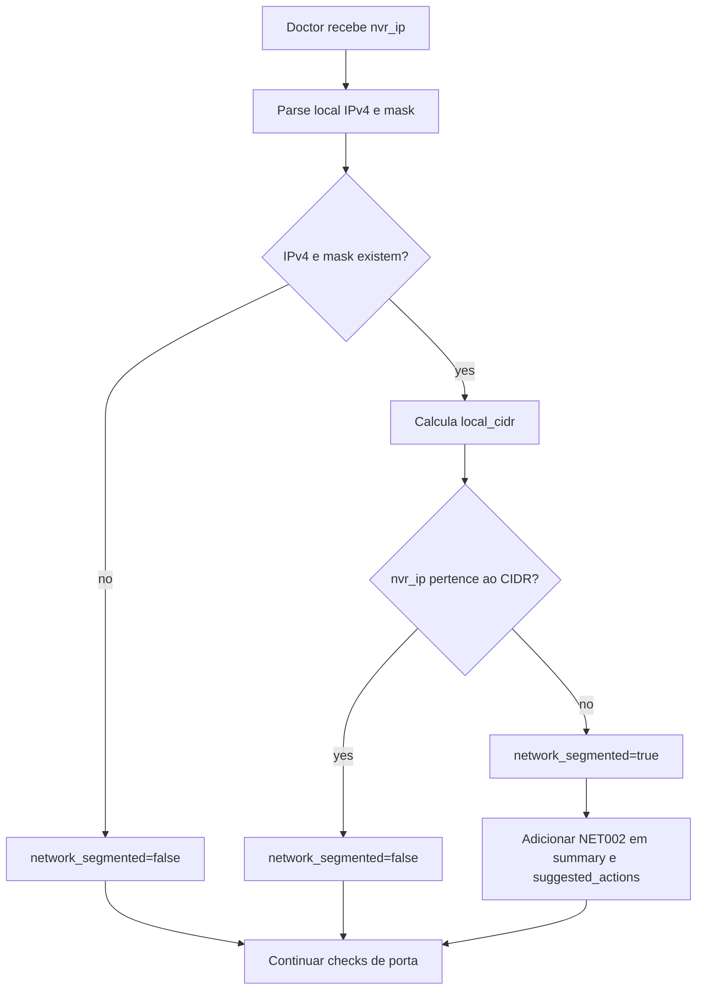
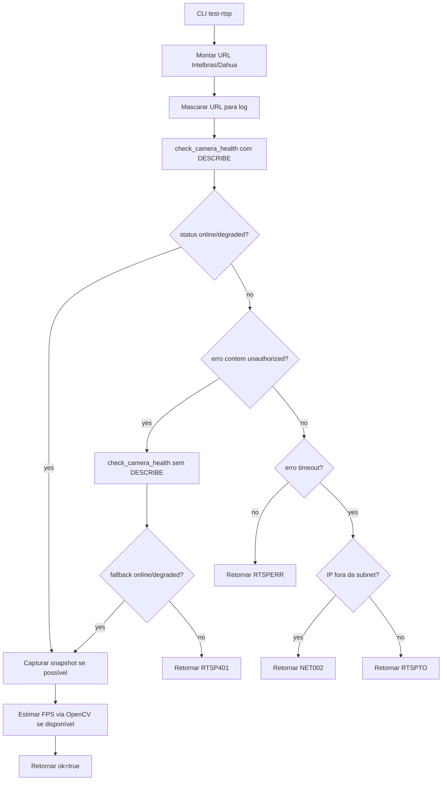
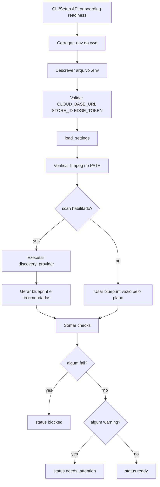
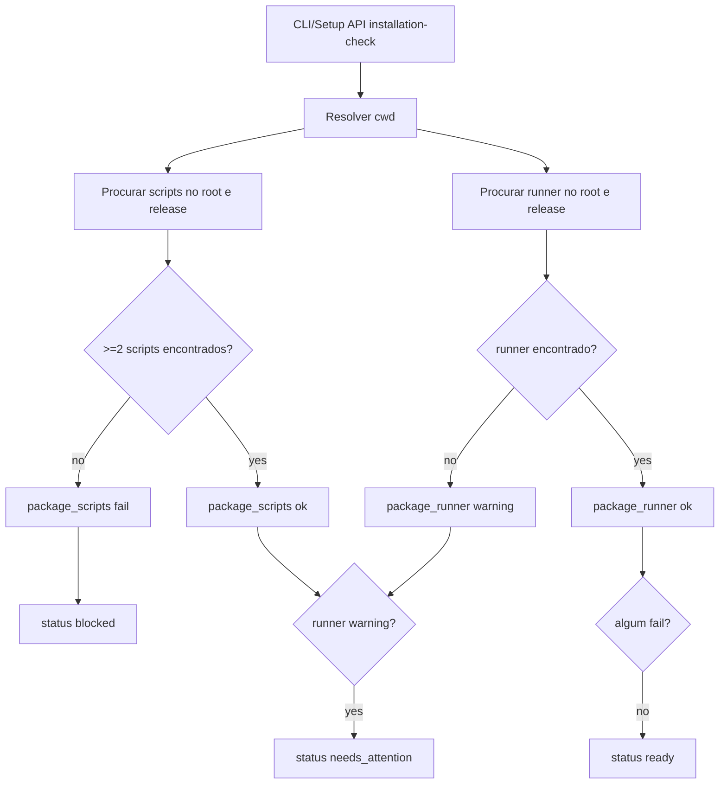
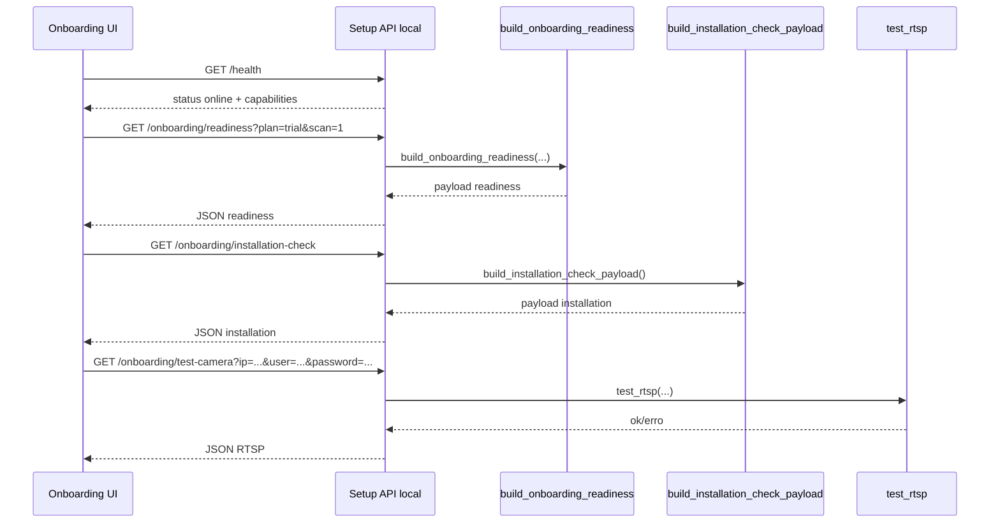

# Edge Agent Diagnostics, Fluxos

## Fluxo 1: Doctor Compartilhável

## Fluxo 2: Detecção de VLAN/Subnet

## Fluxo 3: Teste RTSP com Fallback Digest

## Fluxo 4: Readiness de Onboarding

## Fluxo 5: Installation Check

## Fluxo 6: Setup API Local para Diagnóstico

## Códigos Operacionais

| Código | Condição | Ação esperada | Confiança |
|---|---|---|---|
| `NET001` | Gateway padrão ausente | Verificar cabo/rede do PC. | 🟢 |
| `NET002` | NVR fora do subnet local ou timeout com rede segmentada | Conectar PC e NVR na mesma VLAN/rede. | 🟢 |
| `RTSP554` | Porta 554 fechada no NVR informado | Habilitar RTSP ou liberar porta. | 🟢 |
| `RTSP401` | Credencial RTSP inválida | Revisar usuário/senha do NVR. | 🟢 |
| `RTSPTO` | Timeout RTSP sem segmentação comprovada | Verificar firewall, porta ou NVR inacessível. | 🟢 |
| `RTSPERR` | Erro RTSP genérico | Encaminhar detalhe técnico ao suporte. | 🟢 |
| `NVR_AUTH_FAIL` | Camera health auth failed/401/403 | Revisar credencial do NVR/camera. | 🟢 |
| `RTSP_TIMEOUT` | Camera health timeout | Verificar rede/porta/VLAN. | 🟢 |
| `HEARTBEAT_REJECTED` | Heartbeat HTTP 401/403 | Revisar token edge/store. | 🟢 |

## Arquivos Gerados

| Arquivo | Gatilho | Conteúdo | Confiança |
|---|---|---|---|
| `diagnostics-<id>.json` | Sempre no doctor | Payload completo com checks e comandos brutos. | 🟢 |
| `diagnostics-<id>.txt` | Sempre no doctor | Resumo textual copiável. | 🟢 |
| `diagnostics-share-<id>.zip` | `--share` | JSON, TXT e logs `.log`. | 🟢 |
| Readiness JSON exportado | `onboarding-readiness --export-json` | Payload de readiness. | 🟢 |
| Readiness Markdown exportado | `onboarding-readiness --export-md` | Relatório legível. | 🟢 |

## Pontos de Controle

- 🟢 CONFIRMADO: Todo fluxo de diagnóstico deve retornar payload mesmo com checks parciais falhando.
- 🟢 CONFIRMADO: Falhas de request devem ser registradas e convertidas em erro estruturado.
- 🟢 CONFIRMADO: A senha RTSP deve ser mascarada no log antes de qualquer tentativa.
- 🟢 CONFIRMADO: O ZIP compartilhável deve ser gerado somente quando solicitado por `--share`.
- 🔴 LACUNA: Falta checkpoint explícito para sanitizar dados brutos antes de anexar ao ZIP.
