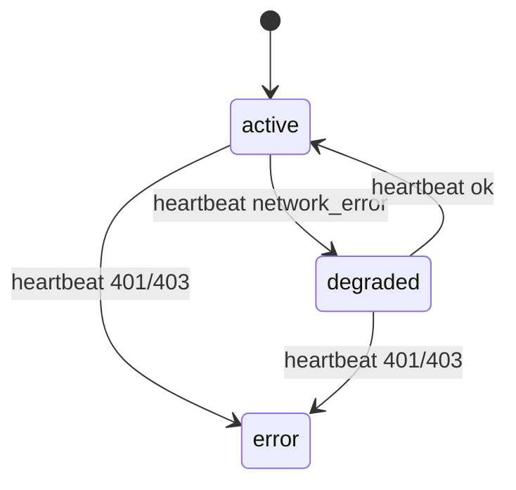

# Calcular Degradação Local, Design Técnico

## Regra de Estado

## Tabela

| `ok` | `status_code` | Próximo estado | Confiança |
|---|---:|---|---|
| true | 2xx | `active` | 🟢 |
| false | null | `degraded` | 🟢 |
| false | 401/403 | `error` | 🟢 |
| false | outro | falha registrada/retry | 🟡 |

## Sleep

| Estado | Intervalo | Confiança |
|---|---:|---|
| `active` | `heartbeat_interval_seconds` | 🟢 |
| `degraded` | `DEGRADED_HEARTBEAT_INTERVAL_SECONDS`, padrão 300 | 🟢 |
