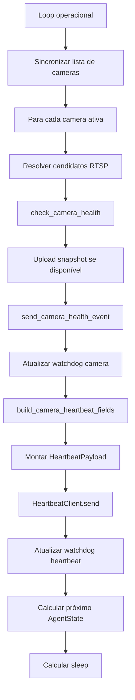

# Edge Agent Heartbeat e Camera Health, Design Técnico

## Interface

| Símbolo / Contrato | Entrada | Saída | Confiança |
|---|---|---|---|
| `send_heartbeat` | URL, edge token, store_id, agent_id, versão, extra_data | `(ok, status, error)` | 🟢 |
| `HeartbeatPayload.to_extra_data` | device, versão, canal, status, uptime, cameras_connected | dict | 🟢 |
| `HeartbeatClient.send` | payload + extra_data | `(ok, status, error)` | 🟢 |
| `check_camera_health` | camera dict, timeout, rtsp override | dict health | 🟢 |
| `send_camera_health_event` | cloud URL, edge token, store/agent/camera health | `(ok, status, error)` | 🟢 |
| Backend edge auth | `X-EDGE-TOKEN` | 200/401/403 | 🟢 |

## Payload Heartbeat

| Campo | Origem | Confiança |
|---|---|---|
| `event_name=edge_heartbeat` | `heartbeat.py` | 🟢 |
| `source=edge` | `heartbeat.py` | 🟢 |
| `store_id` | settings | 🟢 |
| `agent_id` | settings | 🟢 |
| `edge_version` / `installed_version` | runtime/package | 🟢 |
| `status` | `AgentState` normalizado | 🟢 |
| `uptime_seconds` | runtime clock | 🟢 |
| `cameras_connected` | `camera_states` | 🟢 |
| campos agregados de camera | `build_camera_heartbeat_fields` | 🟢 |

## Fluxo Principal

## Estado Interno

| Estado | Uso | Confiança |
|---|---|---|
| `camera_states` | Fonte para heartbeat e contagem online. | 🟢 |
| `watchdog_state.last_heartbeat_ok_at` | Detecção local de travamento/degradação. | 🟢 |
| `watchdog_state.last_camera_health_ok_at` | Detecção de saúde de camera. | 🟢 |
| `consecutive_auth_failures` | Encerrar em auth inválida repetida. | 🟢 |
| `camera_auth_tracker` | Threshold de auth failures em câmera/ROI/evento. | 🟢 |
| `current_agent_state` | Status no heartbeat e intervalo de sleep. | 🟢 |

## Decisões de Design

| Decisão | Evidência | Confiança |
|---|---|---|
| Heartbeat encapsulado como evento edge genérico. | `heartbeat.py` payload `event_name=edge_heartbeat` | 🟢 |
| Camera health é enviado por evento separado e também resumido no heartbeat. | `main.py`, `cameras.py` | 🟢 |
| Erro de rede degrada em vez de encerrar. | `tests/test_heartbeat_state.py` | 🟢 |
| Auth 401/403 é tratado como erro forte. | `main.py`, `cameras.py` | 🟢 |
| Snapshot é best-effort e não bloqueia health. | `domain.md`, `cameras.py` | 🟢 |
| Backend usa buckets/minute stats e status derivado. | `apps/edge/models.py`, `views_edge_status.py` | 🟢 |

## Observabilidade

- 🟢 Console imprime `Heartbeat -> <url> status=<status>`.
- 🟢 Logs registram `camera_id`, `status`, `latency_ms`, `roi_version`, cache e falhas de evento.
- 🟢 Watchdog armazena último heartbeat e camera health ok.
- 🟢 Backend possui `EdgeEventMinuteStats` e status events com cooldown/deduplicação.

## Riscos

- 🟢 DECIDIDO: O SLA de saúde define o threshold de **15 minutos** em estado `degraded` (dentro do horário de funcionamento) antes de intervenção automática ou alerta crítico.
- 🟢 CONFIRMADO: Fora do horário de funcionamento, thresholds de tempo são pausados (Standby).
- 🟡 Muitos sinais são redundantes; uma reimplementação deve preservar compatibilidade antes de simplificar.
- 🟡 Falhas não fatais de camera sync podem esconder problemas se logs não forem monitorados.
