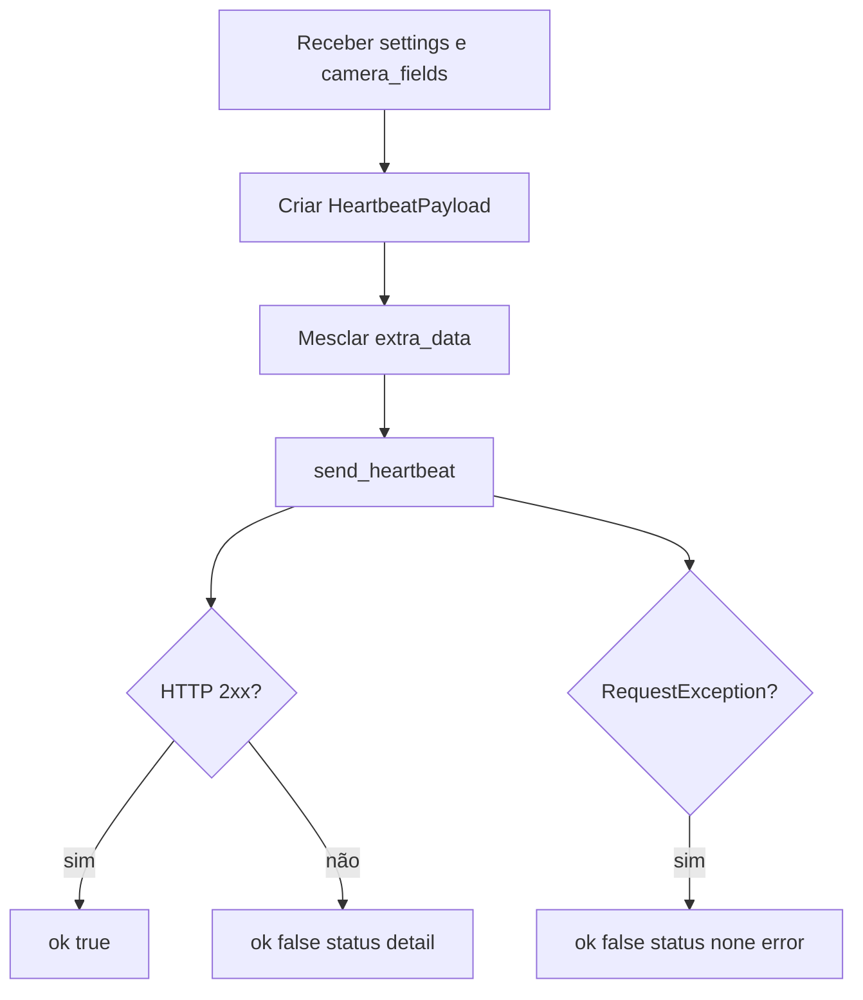

# Enviar Heartbeat, Design Técnico

## Fluxo

## Evidência

| Arquivo | Símbolo | Confiança |
|---|---|---|
| `heartbeat.py` | `send_heartbeat` | 🟢 |
| `heartbeat_client.py` | `HeartbeatPayload`, `HeartbeatClient.send` | 🟢 |
| `main.py` | chamada no loop | 🟢 |
