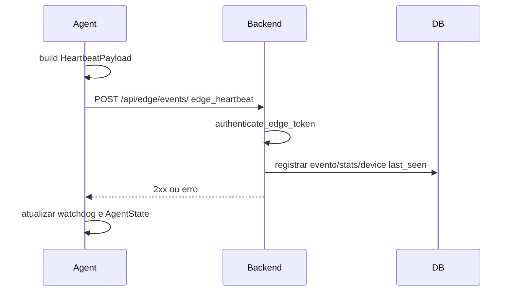
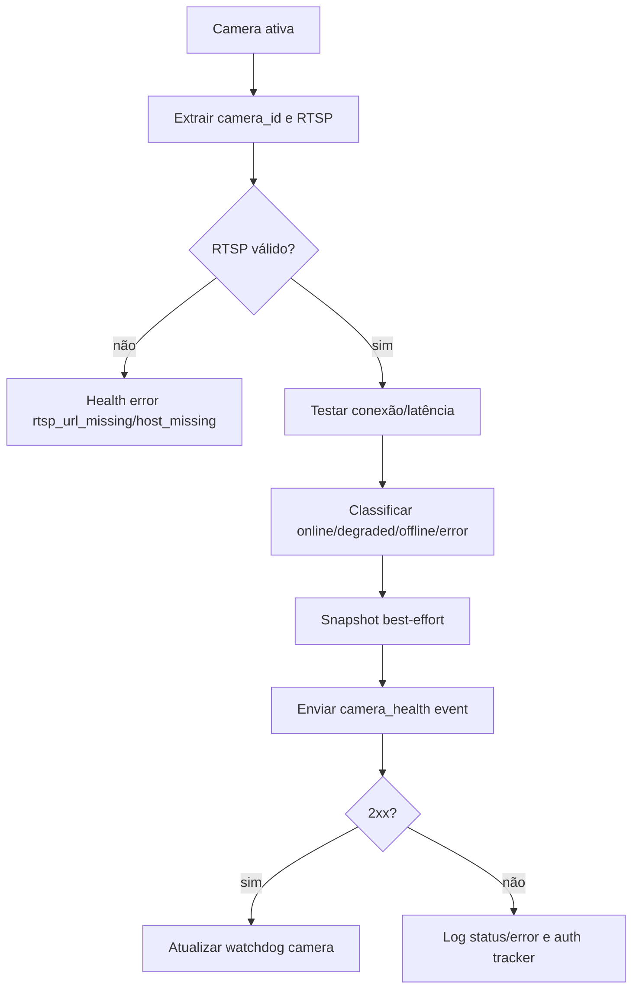
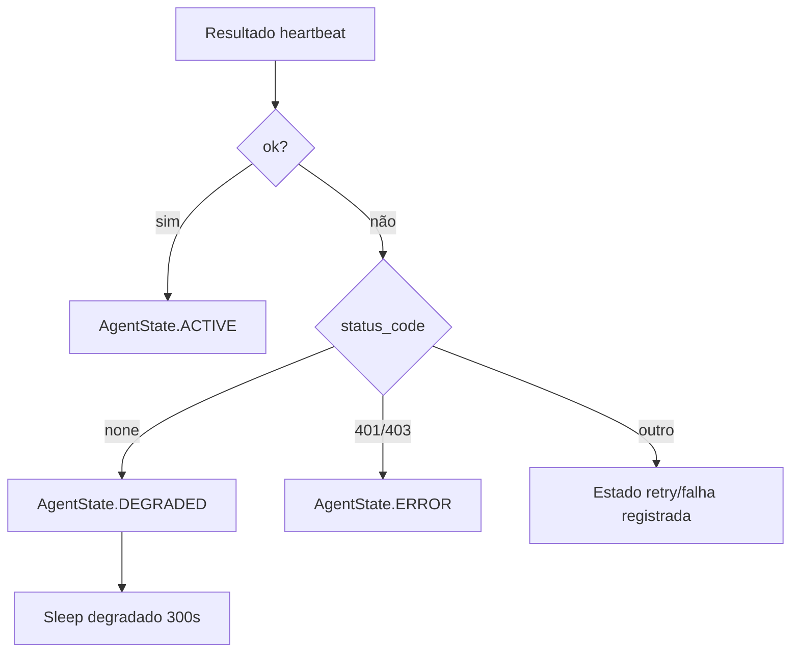
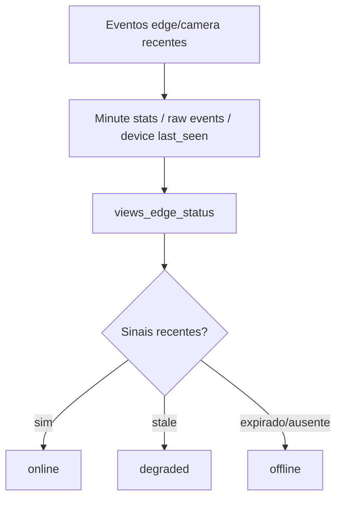

# Edge Agent Heartbeat e Camera Health, Fluxos

## Fluxo Heartbeat

```mermaid
sequenceDiagram
    participant Agent
    participant Backend
    participant DB
    Agent->>Agent: build HeartbeatPayload
    Agent->>Backend: POST /api/edge/events/ edge_heartbeat
    Backend->>Backend: authenticate_edge_token
    Backend->>DB: registrar evento/stats/device last_seen
    Backend-->>Agent: 2xx ou erro
    Agent->>Agent: atualizar watchdog e AgentState
```

## Fluxo Camera Health

```mermaid
flowchart TD
    A[Camera ativa] --> B[Extrair camera_id e RTSP]
    B --> C{RTSP válido?}
    C -- não --> D[Health error rtsp_url_missing/host_missing]
    C -- sim --> E[Testar conexão/latência]
    E --> F[Classificar online/degraded/offline/error]
    F --> G[Snapshot best-effort]
    G --> H[Enviar camera_health event]
    H --> I{2xx?}
    I -- sim --> J[Atualizar watchdog camera]
    I -- não --> K[Log status/error e auth tracker]
```

## Fluxo Degradação Local

```mermaid
flowchart TD
    A[Resultado heartbeat] --> B{ok?}
    B -- sim --> C[AgentState.ACTIVE]
    B -- não --> D{status_code}
    D -- none --> E[AgentState.DEGRADED]
    D -- 401/403 --> F[AgentState.ERROR]
    D -- outro --> G[Estado retry/falha registrada]
    E --> H[Sleep degradado 300s]
```

## Fluxo Backend Status

```mermaid
flowchart TD
    A[Eventos edge/camera recentes] --> B[Minute stats / raw events / device last_seen]
    B --> C[views_edge_status]
    C --> D{Sinais recentes?}
    D -- sim --> E[online]
    D -- stale --> F[degraded]
    D -- expirado/ausente --> G[offline]
```
