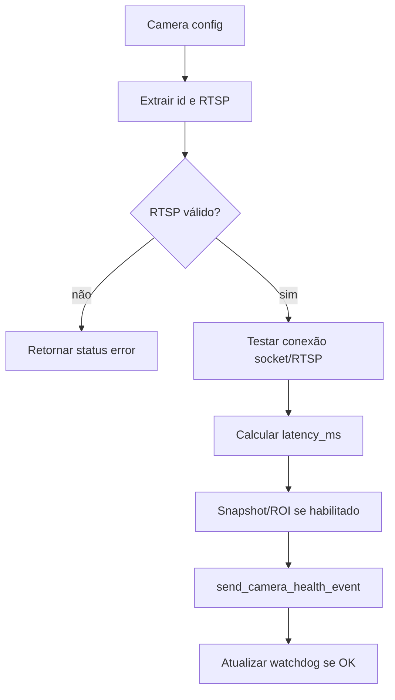

# Reportar Camera Health, Design Técnico

## Fluxo

## Campos

| Campo | Uso | Confiança |
|---|---|---|
| `camera_id` | Identidade da camera. | 🟢 |
| `status` | Status operacional. | 🟢 |
| `latency_ms` | Sinal de qualidade. | 🟢 |
| `checked_at` | Timestamp de coleta. | 🟢 |
| `error` | Diagnóstico de falha. | 🟢 |
| `roi_version` | Contexto de configuração. | 🟢 |
