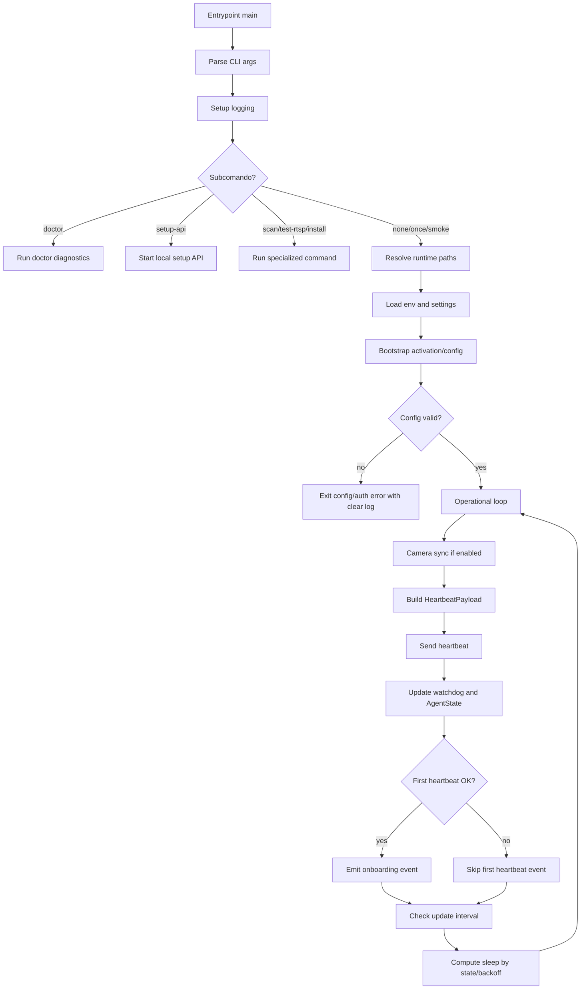

# Edge Agent Runtime, Design Técnico

## Interface

🟢 CONFIRMADO: A interface primária desta unit é o entrypoint Python `dalevision_edge_agent.main`, executado por `python -m dalevision_edge_agent.main` ou pelo executável empacotado. O runtime também expõe subcomandos para suporte, onboarding, descoberta, RTSP e instalação.

### CLI

| Comando / Opção | Entrada | Saída | Observação | Confiança |
|---|---|---|---|---|
| `python -m dalevision_edge_agent.main` | Variáveis `.env` e ambiente | Loop contínuo do agente | Envia heartbeat, camera health, eventos e update conforme configuração. | 🟢 |
| `--once` | Configuração válida | Um heartbeat e encerramento | Usado para teste rápido de conectividade com backend. | 🟢 |
| `--smoke-seconds <N>` | `N: int` e `CAMERAS_JSON` quando aplicável | Execução curta de heartbeat + camera health | Teste operacional limitado no tempo. | 🟢 |
| `doctor --nvr-ip <IP> --share` | IP opcional do NVR e flag de pacote | Diagnóstico local compartilhável | Roteia para `run_doctor`. | 🟢 |
| `setup-api --host --port` | Host e porta, padrão `127.0.0.1:8787` | HTTP local para onboarding | Roteia para `serve_setup_api`. | 🟢 |
| `scan` | Rede local | Descoberta de NVR/cameras | Usa fluxo de scan/discovery. | 🟢 |
| `test-rtsp` | URL/credenciais RTSP | Resultado de conectividade | Usado por suporte/onboarding. | 🟢 |

### Classes e Funções Principais

| Símbolo | Assinatura / Entrada | Retorno | Observação | Confiança |
|---|---|---|---|---|
| `main._parse_args` | CLI process args | `argparse.Namespace` | Define comandos e flags operacionais. | 🟢 |
| `main._setup_logging` | Nenhuma entrada explícita | `logging.Logger` | Configura logger `dalevision-edge-agent` com `RotatingFileHandler`. | 🟢 |
| `paths.resolve_runtime_paths` | `version: str = "unknown"` | `RuntimePaths` | Resolve/cria app, config, logs, cache e tmp. | 🟢 |
| `env.load_env_from_cwd` | Ambiente/processo | valores de `.env` | Carrega configuração local. | 🟢 |
| `env.load_settings` | valores normalizados | settings do agente | Exige `CLOUD_BASE_URL`, `STORE_ID`, `EDGE_TOKEN`, `AGENT_ID`. | 🟢 |
| `activation.ConfigManager.from_default` | `DALE_AGENT_CONFIG_PATH`, `DALE_CONFIG_DIR`, cwd | `ConfigManager` | Resolve arquivo de configuração persistida. | 🟢 |
| `activation.StateMachine.set_state` | `new_state`, `reason` | `None` | Atualiza estado e registra transição. | 🟢 |
| `main._next_agent_state_after_heartbeat` | `current_state`, `ok`, `status_code` | `AgentState` | Mapeia sucesso/rede/auth para estado seguinte. | 🟢 |
| `main._heartbeat_sleep_seconds` | estado, intervalos, backoff | `int` | Define espera ativa/degradada/backoff. | 🟢 |
| `setup_api.serve_setup_api` | `host`, `port`, providers | Servidor HTTP local | Atende rotas locais de onboarding. | 🟢 |

## Fluxo Principal

1. 🟢 CONFIRMADO: O entrypoint executa `_parse_args()` para determinar se deve iniciar o loop contínuo ou um subcomando especializado em `src/dalevision_edge_agent/main.py`.
2. 🟢 CONFIRMADO: O runtime chama `_setup_logging()` e prepara logs legíveis e rotacionados para suporte remoto em `src/dalevision_edge_agent/main.py`.
3. 🟢 CONFIRMADO: O runtime resolve diretórios persistentes e temporários com `resolve_runtime_paths()` em `src/dalevision_edge_agent/paths.py`.
4. 🟢 CONFIRMADO: O runtime carrega `.env` e settings por `load_env_from_cwd()` e `load_settings()` em `src/dalevision_edge_agent/env.py`.
5. 🟢 CONFIRMADO: Se a instalação ainda depende de ativação, `bootstrap_activation()` usa `ConfigManager` e `StateMachine` para chegar a `unprovisioned`, `activating`, `active` ou `error` em `src/dalevision_edge_agent/activation.py`.
6. 🟢 CONFIRMADO: No loop operacional, o runtime sincroniza cameras quando habilitado, monta campos agregados de camera e constrói `HeartbeatPayload`.
7. 🟢 CONFIRMADO: O runtime envia heartbeat via `HeartbeatClient.send()` usando `EDGE_TOKEN`, `STORE_ID`, `AGENT_ID`, versão e capabilities.
8. 🟢 CONFIRMADO: O resultado do heartbeat atualiza watchdog, estado do agente e evento de onboarding `agent_first_heartbeat` quando for o primeiro sucesso.
9. 🟢 CONFIRMADO: Em intervalos configurados, o runtime verifica update, aplica política/health gate quando cabível e envia relatório de update.
10. 🟢 CONFIRMADO: O runtime calcula o próximo sleep com `_heartbeat_sleep_seconds()`; em estado `degraded`, usa intervalo degradado por padrão.

## Fluxos Alternativos

- **Doctor local:** 🟢 CONFIRMADO: Quando o subcomando é `doctor`, o runtime chama `run_doctor()` e encerra sem entrar no loop contínuo.
- **Setup API local:** 🟢 CONFIRMADO: Quando o subcomando é `setup-api`, o runtime inicia `serve_setup_api()` em host/porta configurados para onboarding local.
- **Heartbeat único:** 🟢 CONFIRMADO: Com `--once`, o runtime envia apenas um heartbeat e encerra, útil para validar conectividade.
- **Falha de rede no heartbeat:** 🟢 CONFIRMADO: Se não há status HTTP, `_next_agent_state_after_heartbeat()` retorna `AgentState.DEGRADED`.
- **Falha de autenticação:** 🟢 CONFIRMADO: Status 401/403 no heartbeat leva a `AgentState.ERROR`; falhas consecutivas podem encerrar com `EXIT_AUTH_ERROR`.
- **Camera sync não fatal:** 🟢 CONFIRMADO: Quando `CAMERA_SYNC_FATAL=0`, falhas de camera/ROI/evento são registradas e o runtime continua.
- **Update pós-instalação:** 🟢 CONFIRMADO: O health gate pós-update exige heartbeat bem-sucedido dentro do timeout; se falhar, o rollback pode ser aplicado.
- **Configuração ausente:** 🟢 CONFIRMADO: Ausência de campos obrigatórios gera erro de configuração antes do loop operacional válido.

## Dependências

- 🟢 CONFIRMADO: `dalevision_edge_agent.activation` fornece `AgentState`, `ConfigManager`, `StateMachine` e bootstrap de ativação.
- 🟢 CONFIRMADO: `dalevision_edge_agent.env` carrega `.env`, aliases `DALE_*`, normaliza URL e valida campos obrigatórios.
- 🟢 CONFIRMADO: `dalevision_edge_agent.paths` isola paths persistentes e temporários do runtime.
- 🟢 CONFIRMADO: `dalevision_edge_agent.heartbeat_client` e `dalevision_edge_agent.heartbeat` enviam presença ao backend.
- 🟢 CONFIRMADO: `dalevision_edge_agent.cameras` fornece camera sync, health, snapshot e campos agregados de heartbeat.
- 🟢 CONFIRMADO: `dalevision_edge_agent.setup_api` expõe HTTP local de onboarding.
- 🟢 CONFIRMADO: `dalevision_edge_agent.diagnostics` executa doctor.
- 🟢 CONFIRMADO: `dalevision_edge_agent.update` executa checagem, download, health gate, rollback e relatório de update.
- 🟢 CONFIRMADO: Backend cloud em `C:\workspace\dale-vision` recebe heartbeat/eventos por HTTPS REST.
- 🟡 INFERIDO: Windows Task Scheduler e atalhos de startup são dependências operacionais relevantes somente em instalação empacotada para cliente.

## Decisões de Design Identificadas

| Decisão | Evidência no código | Confiança |
|---|---|---|
| Runtime centralizado em `main.py` como orquestrador de CLI, heartbeat, camera sync, setup API, doctor, vision e update. | `src/dalevision_edge_agent/main.py` importa e coordena módulos especializados. | 🟢 |
| Estado do agente modelado explicitamente por enum e transições testadas. | `src/dalevision_edge_agent/activation.py` `AgentState`; `tests/test_heartbeat_state.py`. | 🟢 |
| Paths do runtime ficam em AppData por padrão, com overrides por ambiente. | `src/dalevision_edge_agent/paths.py` `resolve_runtime_paths()`. | 🟢 |
| Configuração persistida fica separada de `.env`, mas pode hidratar variáveis de ambiente após ativação. | `ConfigManager` e `hydrate_runtime_env_from_activation_config()` em `activation.py`. | 🟢 |
| Logs usam rotação e mensagens curtas para suporte remoto. | `src/dalevision_edge_agent/main.py` `_setup_logging()`. | 🟢 |
| Falha de rede degrada, falha de autenticação vira erro. | `tests/test_heartbeat_state.py`; `_next_agent_state_after_heartbeat()`. | 🟢 |
| Setup API local usa CORS aberto para facilitar onboarding local. | `src/dalevision_edge_agent/setup_api.py` `_set_cors_headers()`. | 🟢 |
| Health gate de update depende de heartbeat bem-sucedido antes de considerar nova versão saudável. | `src/dalevision_edge_agent/main.py` `_run_post_update_health_gate()`. | 🟢 |

## Estado Interno

| Estado / Dado | Onde fica | Evolução | Confiança |
|---|---|---|---|
| `AgentState` | Memória via `StateMachine` | `unprovisioned` -> `activating` -> `active`; `active` -> `degraded` em falha de rede; `active/degraded` -> `error` em 401/403. | 🟢 |
| Configuração de ativação | Arquivo gerenciado por `ConfigManager` | Criada/atualizada durante bootstrap e reutilizada quando device já existe. | 🟢 |
| `.env` runtime | `DALE_ENV_PATH`, `DALE_CONFIG_DIR/.env` ou cwd | Pode ser hidratado após ativação com cloud/store/token/agent. | 🟢 |
| Runtime paths | `%LOCALAPPDATA%\DaleVision`, `%APPDATA%\DaleVision` ou overrides | Criados a cada inicialização quando ausentes. | 🟢 |
| Watchdog state | Memória do loop | Atualizado com último heartbeat ok/status/error. | 🟢 |
| Backoff/intervalo | Memória do loop | Calculado por estado e falhas; `degraded` usa intervalo específico. | 🟢 |
| Camera states | Memória do loop | Atualizado em camera sync e resumido no heartbeat. | 🟢 |
| Pending update payload | `updates/pending.json` | Lido após update para health gate/rollback. | 🟢 |

## Observabilidade

- 🟢 CONFIRMADO: Logger principal é `dalevision-edge-agent`, configurado com `INFO`, sem propagação e com `RotatingFileHandler`.
- 🟢 CONFIRMADO: O runtime imprime status de heartbeat no console e registra sucesso/falha em log.
- 🟢 CONFIRMADO: Falhas de heartbeat registram status HTTP ou erro de rede.
- 🟢 CONFIRMADO: Falhas de autenticação registram status, store e URL cloud, sem registrar token bruto.
- 🟢 CONFIRMADO: Ativação registra ausência/presença e tamanho do token, não o valor do token.
- 🟢 CONFIRMADO: Setup API redige textos sensíveis para evitar vazamento de credenciais RTSP em erros.
- 🟢 CONFIRMADO: Update registra códigos curtos como `UPD041`, `UPD050`, `UPD051`, úteis para suporte.
- 🟡 INFERIDO: Em produção, `logs/agent.log`, `logs/update.log` e `diagnostics.*` são os principais artefatos de suporte para investigação remota.

## Riscos e Lacunas

- 🟢 DECIDIDO: O instalador deve ser **User-level** (sem exigência de privilégios administrativos). O Autostart será implementado via atalho na pasta `%APPDATA%\Microsoft\Windows\Start Menu\Programs\Startup`.
- 🟢 DECIDIDO: O SLA de saúde define um threshold de **15 minutos** em estado `degraded` antes de tentar o restart dos workers, respeitando o horário de funcionamento da loja.
- 🟢 DECIDIDO: Fora do horário de funcionamento, o agente entra em modo **Standby** (processamento reduzido ou pausado), suspendendo alertas e reinícios para evitar falso positivo/ruído.
- 🟢 DECIDIDO: Alerta crítico para o suporte é disparado após **3 reinícios falhos dentro de 1 hora** (em horário comercial).
- 🟡 RISCO: `main.py` concentra muitas responsabilidades de orquestração; mudanças no runtime podem afetar heartbeat, camera health, update e onboarding ao mesmo tempo.
- 🟡 RISCO: Setup API local usa CORS aberto; aceitável para onboarding local, mas requer cuidado se host for alterado de `127.0.0.1`.
- 🟡 RISCO: Falhas não fatais de camera sync preservam o loop, mas podem mascarar degradação operacional se logs não forem monitorados.

## Diagrama de Fluxo

## Contratos Preservados

- 🟢 CONFIRMADO: O runtime não deve quebrar o envio de `heartbeat`.
- 🟢 CONFIRMADO: O runtime não deve quebrar campos agregados de `camera_health` no heartbeat.
- 🟢 CONFIRMADO: O runtime não deve registrar senha, token bruto ou credencial RTSP em logs.
- 🟢 CONFIRMADO: O runtime deve manter mensagens de diagnóstico claras para suporte remoto e usuário leigo.
