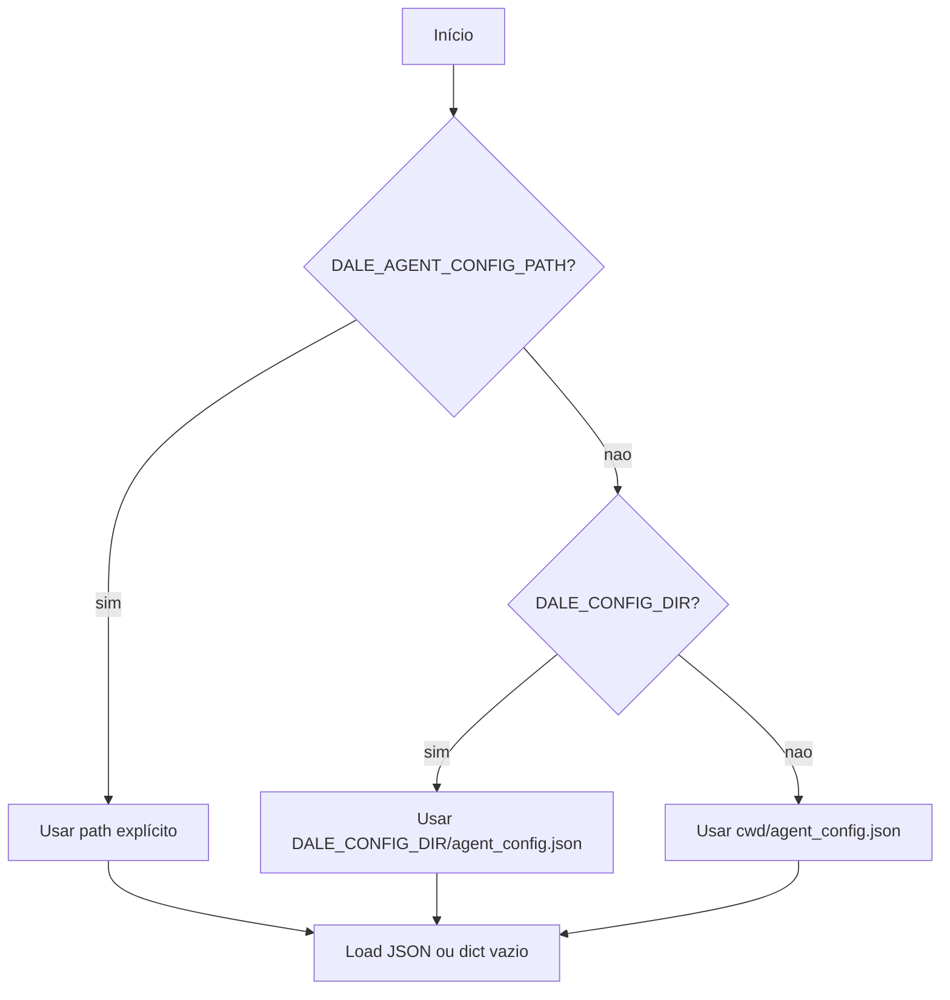
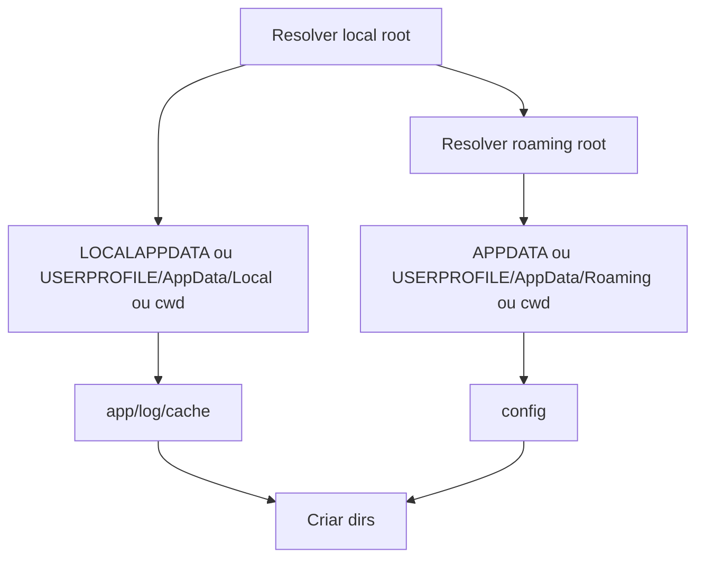

# Estado Local e Configuração, Design Técnico

## Componentes

| Componente | Responsabilidade | Confiança |
|---|---|---|
| `ConfigManager` | Ler/salvar JSON de configuração do agente. | 🟢 |
| `RuntimePaths` | Transportar app/config/log/cache/tmp dirs. | 🟢 |
| `load_settings` | Validar e normalizar settings operacionais. | 🟢 |
| `hydrate_runtime_env_from_activation_config` | Gravar `.env` após ativação. | 🟢 |

## Fluxo de Resolução

## Fluxo de Paths

## Segurança

- 🟢 `EDGE_TOKEN` pode ser escrito em `.env`, mas não deve ser logado bruto.
- 🟢 Erros contendo credenciais RTSP devem ser redigidos no setup API.
- 🟢 Logs podem conter tamanho do token, store_id e path.

## Lacunas

- 🔴 Confirmar política de permissões ACL esperada para arquivos em AppData.
- 🔴 Confirmar retenção final de temporários por versão em produção.
