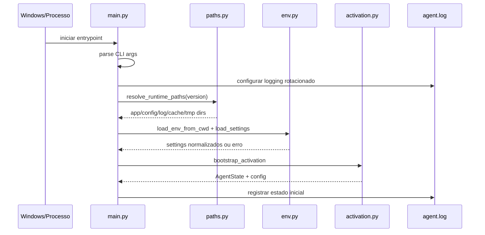
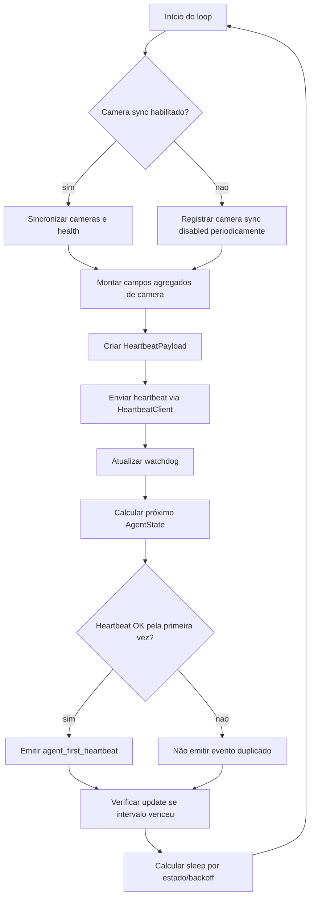
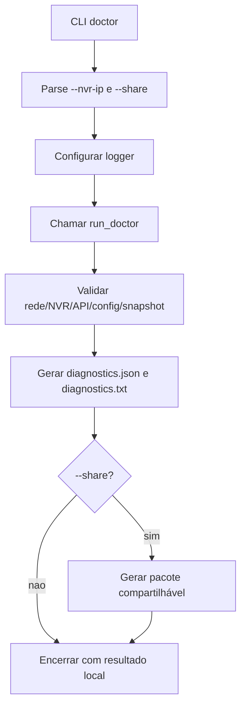
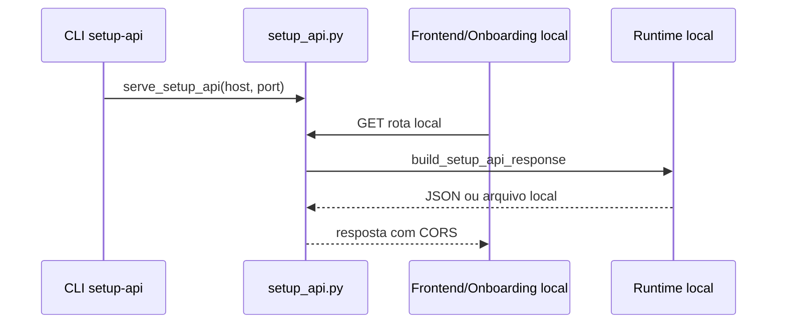
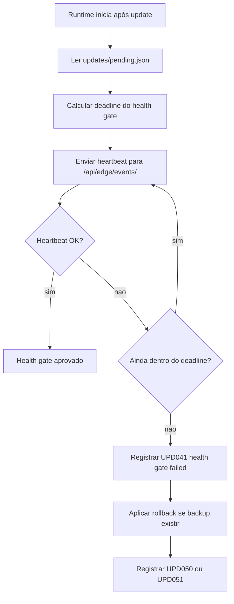
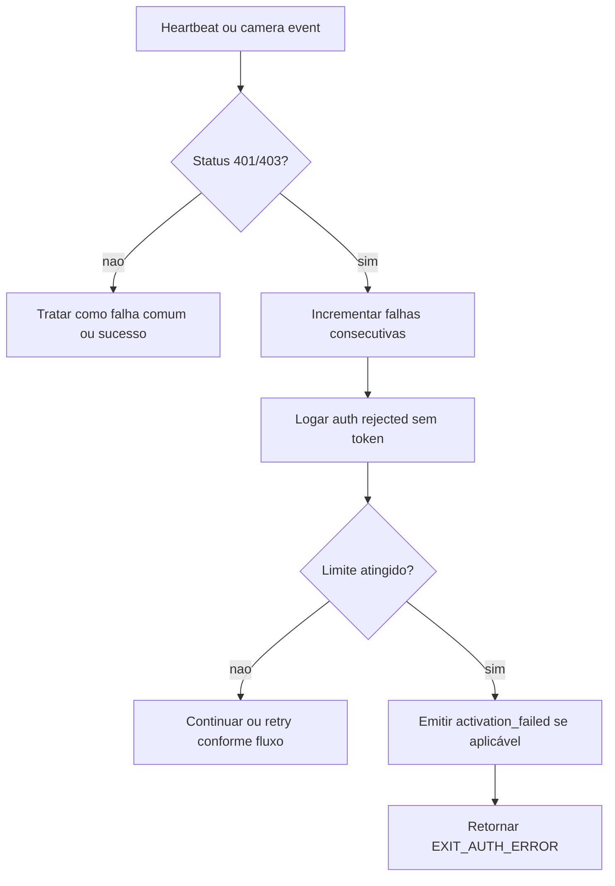
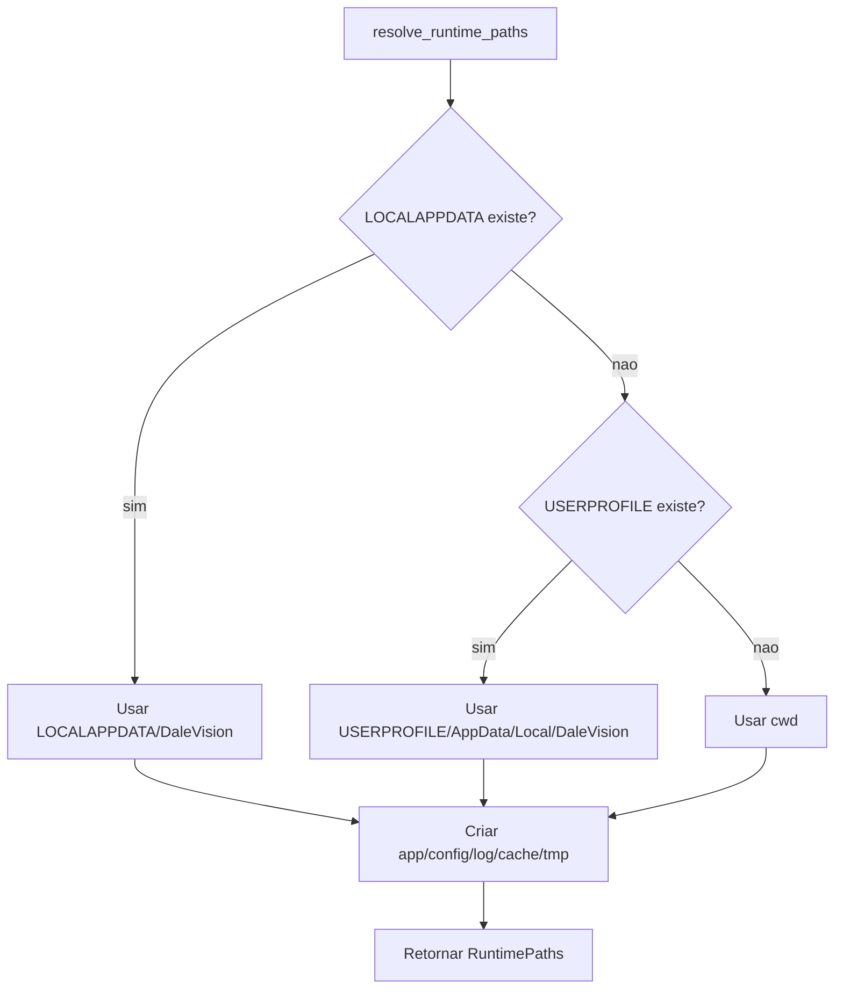

# Edge Agent Runtime, Fluxos Operacionais

## Visão Geral

🟢 CONFIRMADO: Esta unit possui múltiplos fluxos distintos porque `main.py` atua como orquestrador do runtime local, dos subcomandos de suporte/onboarding e do loop operacional contínuo.

## Fluxo 1, Inicialização Contínua do Agente

### Entrada

| Campo | Origem | Obrigatório | Confiança |
|---|---|---|---|
| `CLOUD_BASE_URL` | `.env`, ambiente ou `DALE_CLOUD_BASE_URL` | Sim | 🟢 |
| `STORE_ID` | `.env`, ambiente ou `DALE_STORE_ID` | Sim | 🟢 |
| `EDGE_TOKEN` | `.env`, ambiente ou `DALE_EDGE_TOKEN` | Sim | 🟢 |
| `AGENT_ID` | `.env`, ambiente ou `DALE_AGENT_ID` | Sim no contrato operacional | 🟢 |
| `DALE_*_DIR` | Ambiente | Não | 🟢 |

### Sequência

### Saídas

- 🟢 Diretórios locais criados.
- 🟢 Logger pronto.
- 🟢 Settings validados.
- 🟢 Estado inicial definido.
- 🟢 Erro diagnosticável quando configuração/ativação é inválida.

## Fluxo 2, Loop Operacional de Heartbeat

### Sequência

### Regras de Transição

| Condição | Estado seguinte | Evidência | Confiança |
|---|---|---|---|
| `ok=True` | `active` | `tests/test_heartbeat_state.py` | 🟢 |
| `ok=False`, `status_code=None` | `degraded` | `tests/test_heartbeat_state.py` | 🟢 |
| `ok=False`, `status_code=401` | `error` | `tests/test_heartbeat_state.py` | 🟢 |
| `state=degraded` no sleep | intervalo degradado, padrão 300s | `tests/test_heartbeat_state.py` | 🟢 |

## Fluxo 3, Subcomando Doctor

### Sequência

### Contrato

| Item | Comportamento | Confiança |
|---|---|---|
| Diagnóstico legível | Mensagens devem orientar usuário leigo/suporte remoto. | 🟢 |
| Sem segredos | Não registrar senha, token ou RTSP com credencial. | 🟢 |
| Saída compartilhável | `--share` prepara material para envio. | 🟢 |

## Fluxo 4, Setup API Local

### Sequência

### Rotas/Comportamentos

| Caso | Comportamento | Evidência | Confiança |
|---|---|---|---|
| `OPTIONS` | Retorna 204 com CORS. | `setup_api.py` `do_OPTIONS` | 🟢 |
| `GET` rota de API | Retorna JSON via `build_setup_api_response`. | `setup_api.py` `do_GET` | 🟢 |
| Arquivo HLS local | Serve arquivo de `tmp_streams` quando existe. | `setup_api.py` stream handling | 🟢 |
| Snapshot solicitado | Tenta snapshot e retorna arquivo ou falha controlada. | `setup_api.py` snapshot flow | 🟢 |

## Fluxo 5, Health Gate Pós-Update

### Sequência

### Regras

| Regra | Comportamento | Confiança |
|---|---|---|
| Heartbeat é gate mínimo | Update só é saudável se heartbeat pós-boot funcionar. | 🟢 |
| Camera health pode ficar pendente | O gate registra que camera health ainda não foi avaliado nesse estágio. | 🟢 |
| Rollback é best-effort | Falha de rollback é logada, não escondida. | 🟢 |

## Fluxo 6, Falha de Autenticação no Loop

## Fluxo 7, Paths e Temporários

## Pontos de Observabilidade por Fluxo

| Fluxo | Logs/Eventos | Confiança |
|---|---|---|
| Inicialização | logger configurado, config ausente, activation state. | 🟢 |
| Heartbeat | `Heartbeat -> <url> status=<status>`, warnings de falha. | 🟢 |
| Camera sync | status por camera, ROI error, snapshot upload status. | 🟢 |
| Doctor | diagnostics files e pacote share. | 🟢 |
| Setup API | respostas JSON/arquivos e erros redigidos. | 🟢 |
| Update | `UPD041`, `UPD050`, `UPD051`, update reports. | 🟢 |

## Lacunas de Fluxo

- 🔴 Confirmar política operacional para tempo máximo em `degraded` antes de intervenção.
- 🔴 Confirmar se `setup-api` pode escutar em interface diferente de `127.0.0.1`.
- 🔴 Confirmar matriz final de autostart Windows: shortcut, scheduled task ou serviço, por versão de Windows e nível de privilégio.
