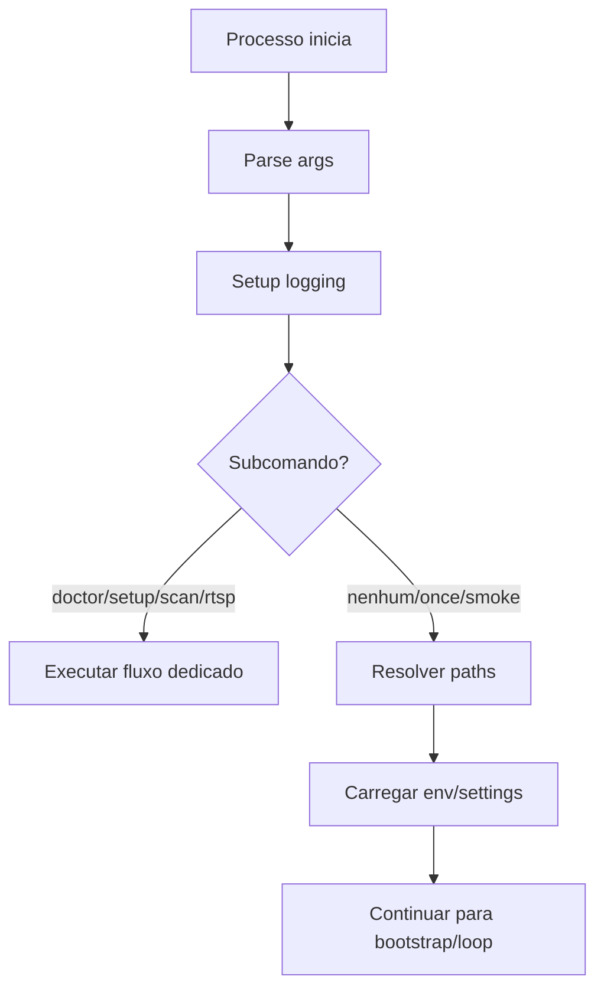

# Inicialização CLI, Design Técnico

## Interface

| Símbolo | Entrada | Retorno | Confiança |
|---|---|---|---|
| `_parse_args()` | `sys.argv` | `argparse.Namespace` | 🟢 |
| `_setup_logging()` | n/a | `logging.Logger` | 🟢 |
| `_get_version()` | package metadata | `str` | 🟢 |
| `resolve_runtime_paths(version)` | versão | `RuntimePaths` | 🟢 |

## Fluxo Principal

## Fluxos Alternativos

- 🟢 `doctor`: executa diagnóstico e encerra.
- 🟢 `setup-api`: inicia servidor local.
- 🟢 `--once`: executa uma tentativa de heartbeat.
- 🟢 Config inválida: retorna erro diagnosticável.

## Decisões

| Decisão | Evidência | Confiança |
|---|---|---|
| Um único entrypoint centraliza subcomandos e loop. | `main.py` `_parse_args` | 🟢 |
| Logger evita handlers duplicados. | `main.py` `_setup_logging` | 🟢 |
| Versão pode vir de metadata ou fallback. | `main.py` `_get_version` | 🟢 |

## Riscos

- 🟡 `main.py` acumula muitas responsabilidades; subcomandos devem ser testados para evitar regressões cruzadas.
- 🔴 Validar exit codes finais esperados pelo autostart/instalador.
