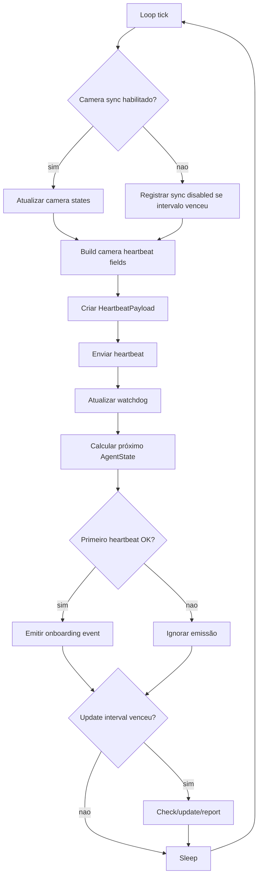

# Loop Operacional, Design Técnico

## Fluxo

## Estado Interno

| Estado | Uso | Confiança |
|---|---|---|
| `current_agent_state` | Define status no heartbeat e intervalo de sleep. | 🟢 |
| `watchdog_state` | Guarda último heartbeat ok/status/error. | 🟢 |
| `camera_states` | Fonte para contagem e campos agregados. | 🟢 |
| `first_heartbeat_reported` | Evita duplicar evento de onboarding. | 🟢 |
| `last_update_check_at` | Controla frequência de update. | 🟢 |

## Fluxos de Erro

- 🟢 Status 401/403 incrementa falhas de autenticação e pode retornar `EXIT_AUTH_ERROR`.
- 🟢 Status `None` indica erro de rede e degrada o estado.
- 🟢 Falha de camera sync pode ser não fatal conforme `CAMERA_SYNC_FATAL`.
- 🟢 Falha no vision proxy é warning e não encerra o loop.

## Observabilidade

- 🟢 Console imprime `Heartbeat -> <url> status=<status>`.
- 🟢 Logs registram sucesso/falha de heartbeat.
- 🟢 Logs registram ROI/camera/snapshot/update sem segredos.

## Lacunas

- 🔴 SLA final de duração em `degraded` antes de intervenção.
