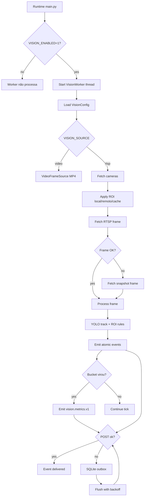

# Edge Agent Vision, Design Técnico

## Interface

🟢 CONFIRMADO: A interface primária da unit é o `VisionWorker`, iniciado pelo runtime principal quando `VISION_ENABLED=1`. A interface externa é o endpoint backend `POST /api/edge/events/`.

### Variáveis de Ambiente

| Variável | Padrão | Uso | Confiança |
|---|---:|---|---|
| `VISION_ENABLED` | `0` | Liga/desliga worker. | 🟢 |
| `VISION_SOURCE` | `rtsp` | Fonte `rtsp` ou `video`. | 🟢 |
| `VISION_BUCKET_SECONDS` | `30` | Duração do bucket agregado. | 🟢 |
| `VISION_POLL_SECONDS` | `5` | Intervalo entre ticks. | 🟢 |
| `VISION_MAX_CAMERAS` | `10` | Máximo de câmeras por tick. | 🟢 |
| `VISION_FRAME_STRIDE` | `1` | Redução de inferência por frame. | 🟢 |
| `VISION_MODEL_PATH` | `yolov8n.pt` | Modelo YOLO usado por ultralytics. | 🟢 |
| `VISION_ROLE_MAP` | `{}` | Mapeamento nome/external_id para papel. | 🟢 |
| `VISION_ALERTS_ENABLED` | `0` | Liga alertas de fila/ociosidade/celular. | 🟢 |
| `VISION_OUTBOX_ENABLED` | `1` | Liga outbox SQLite. | 🟢 |
| `VISION_OUTBOX_PATH` | cache local | Caminho do SQLite de outbox. | 🟢 |
| `VISION_OUTBOX_BATCH_SIZE` | `50` | Tamanho do flush. | 🟢 |
| `VISION_OUTBOX_MAX_ATTEMPTS` | `8` | Tentativas antes de descartar. | 🟢 |
| `VISION_VIDEO_PATH` | vazio | MP4 local para replay. | 🟢 |
| `VISION_ROI_PATH` | vazio | YAML ROI global ou replay. | 🟢 |
| `VISION_CAMERA_ID` | vazio | ID da câmera em replay. | 🟢 |
| `VISION_ROLE` | vazio | Papel fixo em replay. | 🟢 |
| `VISION_RETAIL_EVENT_V1_ENABLED` | `1` | Liga emissão de `retail.event.v1`. | 🟢 |

### Eventos Enviados

| Event Name | Gatilho | Conteúdo Principal | Backend | Confiança |
|---|---|---|---|---|
| `vision.metrics.v1` | Fechamento de bucket | `traffic`, `conversion`, `bucket`, `ownership` | `apply_vision_metrics()` | 🟢 |
| `vision.crossing.v1` | Crossing de linha em câmera `entrada` | `direction`, `count_value`, `track_id_hash` | `apply_vision_crossing()` | 🟢 |
| `vision.queue_state.v1` | Frame de câmera `balcao` | `count_value`, `staff_active_est` | `apply_vision_queue_state()` | 🟢 |
| `vision.zone_occupancy.v1` | Frame de câmera `salao` | `count_value`, `duration_seconds` | `apply_vision_zone_occupancy()` | 🟢 |
| `vision.checkout_proxy.v1` | Ciclo de pagamento finalizado | `interaction_count`, `duration_seconds` | `apply_vision_checkout_proxy()` | 🟢 |
| `retail.event.v1` | Evento derivado de visão | `event_type`, `value`, `confidence` | Contrato retail event no ingest edge | 🟢 |
| `alert` | Alerta operacional | `event_type`, `severity`, `metadata` | Roteado para alerts ingest | 🟢 |

## Componentes

| Componente | Responsabilidade | Confiança |
|---|---|---|
| `VisionConfig` | Ler configuração de visão por env. | 🟢 |
| `VisionWorker` | Orquestrar busca de câmeras, frames, inferência, métricas e envio. | 🟢 |
| `VisionOutbox` | Persistir eventos offline-first em SQLite. | 🟢 |
| `VideoFrameSource` | Ler MP4 local para replay. | 🟢 |
| `load_roi_yaml` | Carregar zonas/linhas em YAML. | 🟢 |
| `point_in_polygon` / `line_side` | Geometria de ROI. | 🟢 |
| `AdaptiveMotionGate` | Gate opcional para processar apenas frames com movimento. | 🟢 |
| `StreamManager` | Converter RTSP para HLS e gerar snapshot local por ffmpeg. | 🟢 |
| `EdgeEventsIngestView` | Validar, deduplicar e projetar eventos no backend. | 🟢 |

## Modelo de Dados

### Câmera Normalizada

| Campo | Origem | Descrição | Confiança |
|---|---|---|---|
| `id` / `camera_id` | `camera_id` ou `id` | Identificador canônico local. | 🟢 |
| `rtsp_url` | `rtsp_url`, `stream_url`, `rtsp`, `url` | Fonte de frame RTSP. | 🟢 |
| `last_snapshot_url` | `last_snapshot_url`, `snapshot_url`, `snapshot` | Fallback de frame por HTTP. | 🟢 |
| `name` | câmera | Nome para inferir papel. | 🟢 |
| `external_id` | câmera | ID externo/nome para inferir papel. | 🟢 |
| `indicators` | câmera | Indicadores normalizados. | 🟢 |
| `processing_plan` | indicadores | Plano derivado por `build_camera_processing_plan()`. | 🟢 |
| `roi` | backend | ROI remoto normalizado. | 🟢 |
| `roi_local` | YAML/cache | ROI local carregado. | 🟢 |

### Estado por Câmera

| Campo | Descrição | Confiança |
|---|---|---|
| `role` | `entrada`, `balcao` ou `salao`. | 🟢 |
| `bucket_start` | Bucket corrente. | 🟢 |
| `agg` | Agregadores de frames, detections, fila, consumo, entries/exits e checkout. | 🟢 |
| `track_line_side_state` | Último lado da linha por track. | 🟢 |
| `track_line_last_event` | Cooldown de crossing por track/linha. | 🟢 |
| `room_track_enter_ts` | Entrada de track na área de consumo. | 🟢 |
| `checkout_cycle` | Estado do proxy de checkout. | 🟢 |
| `model` | Instância YOLO lazy. | 🟢 |
| `last_alert_ts` | Cooldown de alertas. | 🟢 |

## Fluxo Principal

1. 🟢 CONFIRMADO: `main.py` detecta `VISION_ENABLED=1`.
2. 🟢 CONFIRMADO: O runtime instancia `VisionWorker` com `cloud_base_url`, `store_id`, `edge_token` e logger.
3. 🟢 CONFIRMADO: O worker lê `VisionConfig.from_env()`.
4. 🟢 CONFIRMADO: `run_forever()` encerra cedo se `enabled=false`; caso contrário, registra startup e entra em loop.
5. 🟢 CONFIRMADO: Em cada tick, o worker faz flush do outbox, busca câmeras e calcula bucket atual.
6. 🟢 CONFIRMADO: Para cada câmera até `max_cameras`, resolve papel e inicializa estado.
7. 🟢 CONFIRMADO: O worker tenta frame RTSP; se falhar, tenta snapshot remoto.
8. 🟢 CONFIRMADO: `_process_frame()` extrai ROI, executa YOLO tracking, aplica regras por papel e envia eventos atômicos.
9. 🟢 CONFIRMADO: Ao virar bucket, `_build_payload()` gera `vision.metrics.v1`, loga resumo e envia evento.
10. 🟢 CONFIRMADO: Envio falho é enfileirado no outbox e tentado novamente em ticks posteriores.

## Busca de Câmeras

🟢 CONFIRMADO: `_fetch_cameras()` usa a seguinte ordem condicional:

1. 🟢 Se `VISION_SOURCE=video`, retorna lista vazia para o fluxo RTSP.
2. 🟢 Se `CAMERA_SOURCE_MODE` for `local_only` ou `env_only`, força modo local.
3. 🟢 Se sync remoto estiver habilitado, tenta API edge.
4. 🟢 Se API falhar, usa `CAMERAS_JSON`.
5. 🟢 Se env do processo não tiver `CAMERAS_JSON`, tenta ler `.env`.
6. 🟢 Se ainda vazio, tenta `load_cameras_from_agent_config()`.
7. 🟢 Se não houver câmera local e local-only estiver desligado, tenta cache.
8. 🟢 Se tudo falhar, retorna lista vazia e loga `cameras unavailable`.

## ROI

- 🟢 CONFIRMADO: ROI local via YAML retorna dicionários `zones` e `lines` com pontos inteiros.
- 🟢 CONFIRMADO: ROI remoto usa `fetch_roi()` e normaliza nomes para formas canônicas.
- 🟢 CONFIRMADO: Nomes como caixa/pagamento/fila/consumo/entrada são canonicalizados.
- 🟢 CONFIRMADO: `_extract_roi()` converte pontos normalizados remotos (`0..1`) para pixels com base em `frame.shape`.
- 🟢 CONFIRMADO: Metadados `metric_type`, `ownership`, `zone_id` e `roi_entity_id` são preservados em `zone_meta`/`line_meta`.
- 🟢 CONFIRMADO: Quando `VISION_ROI_PATH` está definido, override local pode ser aplicado a todas as câmeras.

## Processamento por Papel

### Entrada

- 🟢 CONFIRMADO: Usa linhas ROI.
- 🟢 CONFIRMADO: Requer classe pessoa (`cls == 0`) e `track_id`.
- 🟢 CONFIRMADO: Usa `line_side()` para detectar crossing.
- 🟢 CONFIRMADO: Aplica cooldown de 4 segundos por track/linha/direção.
- 🟢 CONFIRMADO: Emite `vision.crossing.v1` e `retail.event.v1` com `person_enter` ou `person_exit`.

### Balcão

- 🟢 CONFIRMADO: Conta fila na zona `area_atendimento_fila`.
- 🟢 CONFIRMADO: Conta staff na zona `zona_funcionario_caixa`.
- 🟢 CONFIRMADO: Conta cliente no `ponto_pagamento`.
- 🟢 CONFIRMADO: Emite `vision.queue_state.v1`.
- 🟢 CONFIRMADO: Detecta fim de ciclo de pagamento e emite `vision.checkout_proxy.v1`.
- 🟢 CONFIRMADO: Pode emitir alertas de fila longa, ociosidade e celular.

### Salão

- 🟢 CONFIRMADO: Conta pessoas na zona `area_consumo`.
- 🟢 CONFIRMADO: Mantém timestamps por track para estimar dwell.
- 🟢 CONFIRMADO: Remove tracks obsoletos após múltiplos polls sem observação.
- 🟢 CONFIRMADO: Emite `vision.zone_occupancy.v1` e `retail.event.v1` de zone dwell.

## Integração Backend

🟢 CONFIRMADO: O backend valida eventos em `EdgeEventsIngestView` antes de persistir.

🟢 CONFIRMADO: O backend calcula ou respeita `receipt_id`, usa cache rápido de dedupe por 60 segundos e depois usa recibo canônico em banco.

🟢 CONFIRMADO: Eventos de visão com câmera validam se a câmera existe por `external_id`, UUID ou nome.

🟢 CONFIRMADO: `vision.metrics.v1` chama `apply_vision_metrics()`.

🟢 CONFIRMADO: Eventos atômicos chamam `insert_vision_atomic_event_if_new()` antes de projeções específicas.

🟢 CONFIRMADO: A tabela `vision_atomic_events` tem `receipt_id text UNIQUE NOT NULL`.

🟢 CONFIRMADO: Falha de contrato retorna `400` com reason `vision_contract_invalid`, `retail_event_contract_invalid` ou `vision_canonical_contract_invalid`.

## Observabilidade

- 🟢 CONFIRMADO: Startup loga source, ROI path, contagem de zones/lines e model path.
- 🟢 CONFIRMADO: RTSP loga `camera_id`, `ok`, `elapsed_ms` e motivo de falha.
- 🟢 CONFIRMADO: Falha de abertura RTSP dispara diagnóstico ffmpeg com URL mascarada.
- 🟢 CONFIRMADO: Buckets logam frames, fila, consumo, staff, queue_avg, detections, stride e crossings.
- 🟢 CONFIRMADO: Outbox loga enviados, falhados, descartados, pendentes e idade do mais antigo.
- 🟢 CONFIRMADO: Backend loga ingest com store, event, age, stored e deduped.

## Segurança

- 🟢 CONFIRMADO: `edge_token` é usado nos headers por `build_auth_headers()`.
- 🟢 CONFIRMADO: Credenciais RTSP são mascaradas em comandos/logs ffmpeg.
- 🟢 CONFIRMADO: Thumbnail de alerta é opcional e pode ser blurado.
- 🟡 INFERIDO: O processamento não tenta identificar pessoa nominalmente; usa classes/track IDs e hashes.
- 🔴 LACUNA: HLS/snapshot local por Setup API usa CORS aberto e deve permanecer restrito a ambiente local/controlado.

## Diagrama de Fluxo

## Riscos e Lacunas

- 🟢 DECIDIDO: O sistema exibirá todas as câmeras detectadas, mas limitará a seleção ativa baseada no plano (**Start: 3**, **Pro: 12**).
- 🟢 DECIDIDO: Monitoramento de performance ativo; se uso de CPU/RAM > 80% constante, disparar aviso de limite de hardware sugerindo redução de câmeras ou upgrade.
- 🟢 DECIDIDO: Respeito total aos horários de funcionamento; processamento de visão é pausado ou reduzido drasticamente fora do expediente.
- 🟢 CONFIRMADO: Edição de seleção de câmeras ativa é permitida sem perda das configurações de zonas (ROI) já mapeadas.
- 🟡 RISCO: `VisionWorker` concentra aquisição, inferência, regra de negócio, eventos e outbox em um arquivo grande.
- 🟡 RISCO: `VISION_ROI_PATH` aplicado a múltiplas câmeras pode gerar métricas erradas se usado em produção sem cuidado.
- 🟡 RISCO: Dependência de `ultralytics` e OpenCV pode variar muito entre máquinas Windows de cliente.
