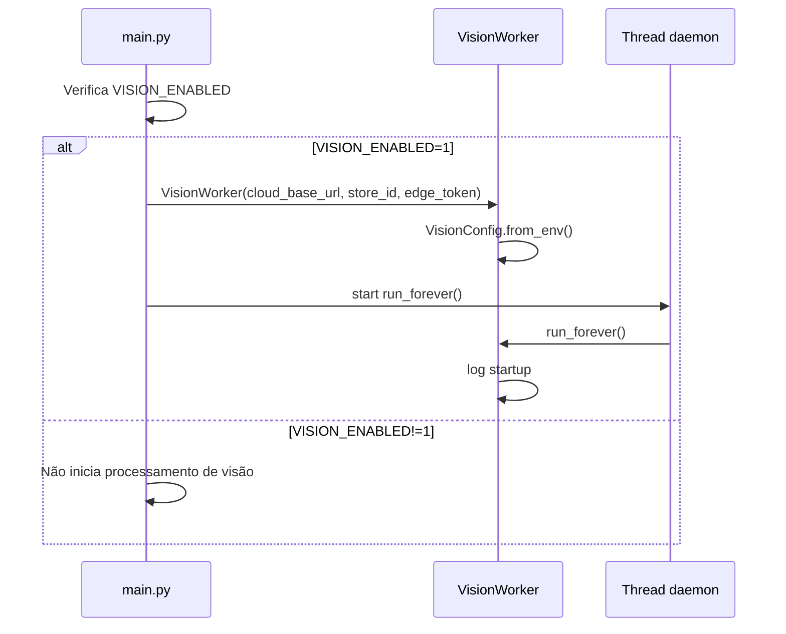
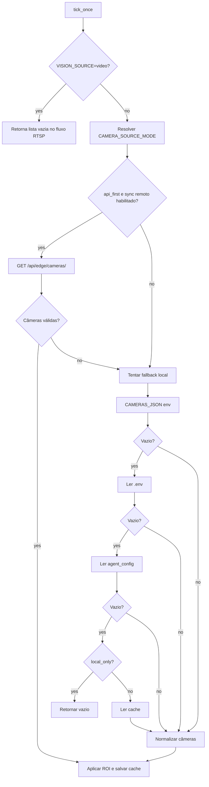
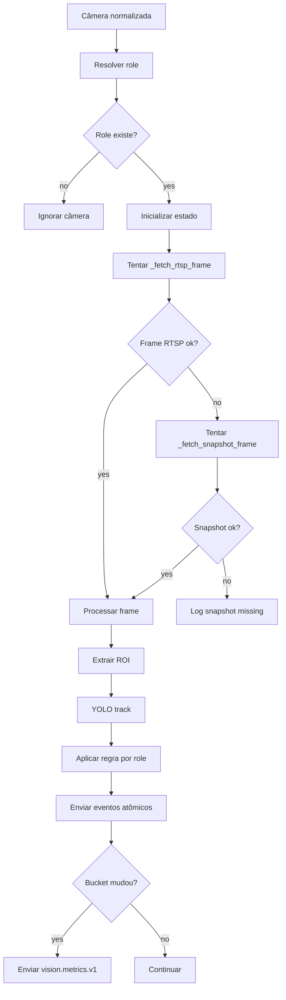
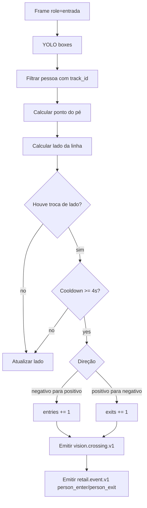
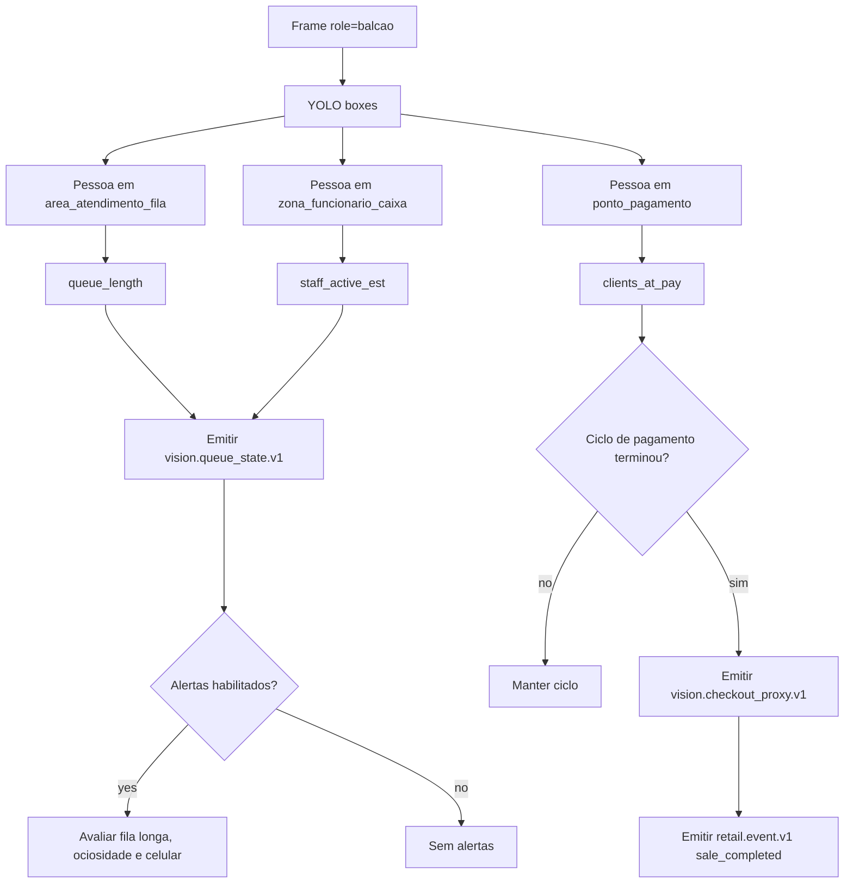
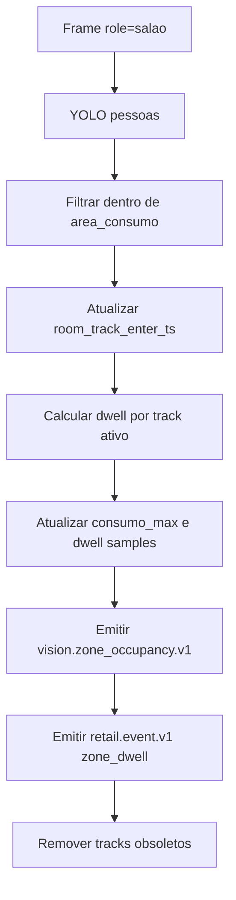
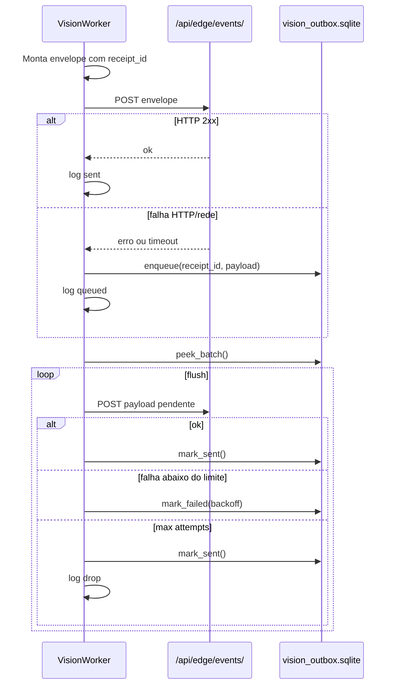
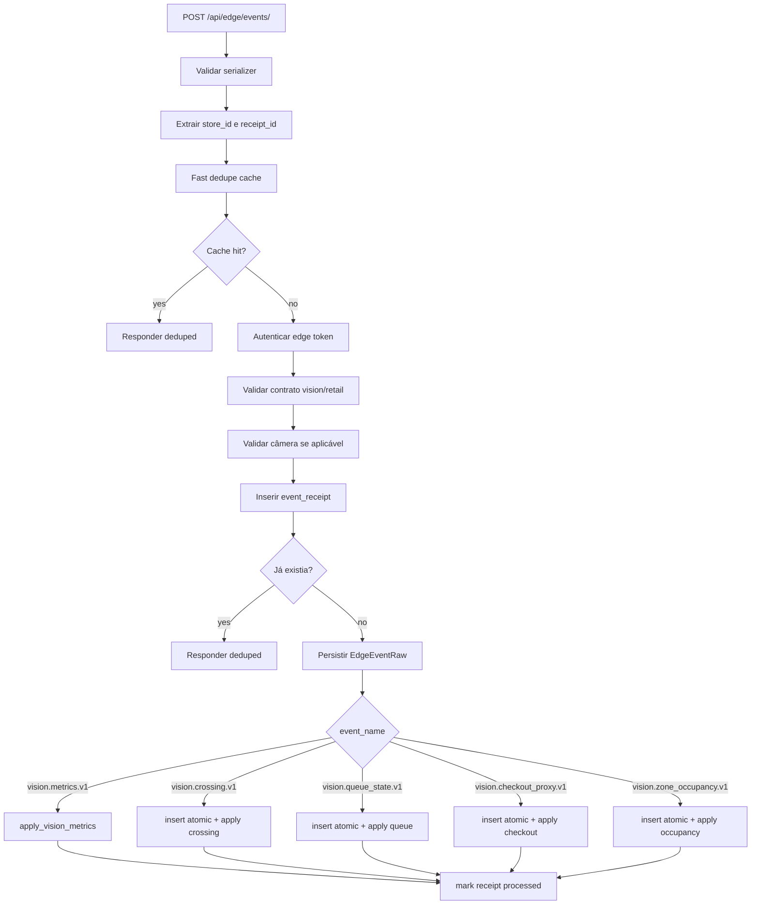
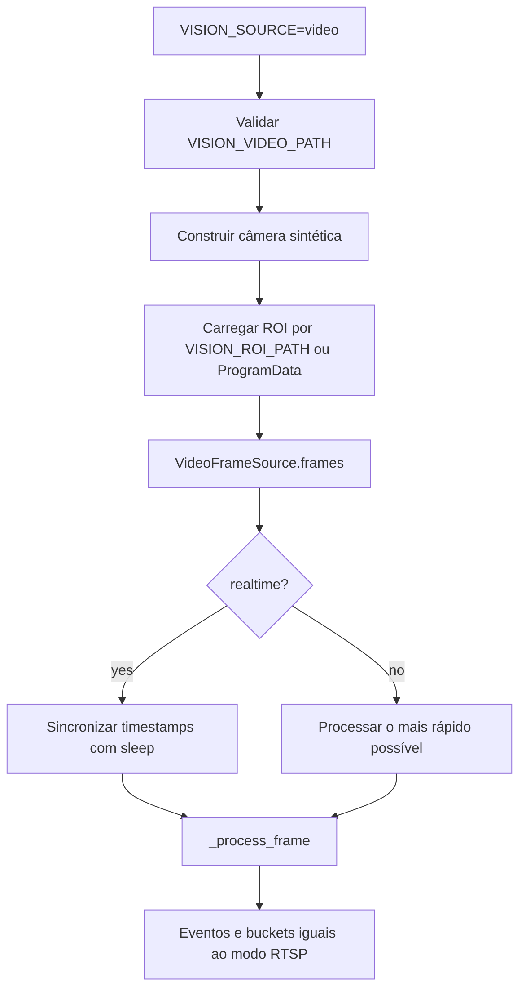

# Edge Agent Vision, Fluxos

## Fluxo 1: Inicialização do Worker

## Fluxo 2: Busca de Câmeras

## Fluxo 3: Processamento RTSP/Snapshot

## Fluxo 4: Entrada, Line Crossing

## Fluxo 5: Balcão, Fila e Checkout Proxy

## Fluxo 6: Salão, Ocupação e Dwell

## Fluxo 7: Envio e Outbox

## Fluxo 8: Ingest Backend

## Fluxo 9: Replay por Vídeo

## Contratos de Saída

| Campo | Evento | Obrigatoriedade | Confiança |
|---|---|---|---|
| `event_name` | Todos | Obrigatório no envelope. | 🟢 |
| `source=edge` | Todos | Obrigatório para ingest edge. | 🟢 |
| `receipt_id` | Todos | Obrigatório para outbox/dedupe efetivo. | 🟢 |
| `idempotency_key` | Todos | Igual ao receipt nos eventos do worker. | 🟢 |
| `data.store_id` | Todos de visão | Obrigatório para projeção. | 🟢 |
| `data.camera_id` | Eventos por câmera | Necessário para validar câmera e presença. | 🟢 |
| `data.metric_type` | Eventos atômicos | Obrigatório no backend. | 🟢 |
| `data.bucket` | `vision.metrics.v1` | Obrigatório para bucket agregado. | 🟢 |
| `data.roi_entity_id` | Eventos com ROI | Usado nas projeções e dedupe semântico. | 🟢 |

## Pontos de Controle

- 🟢 CONFIRMADO: Sem câmera válida, o tick retorna sem erro fatal.
- 🟢 CONFIRMADO: Sem frame válido, a câmera é ignorada naquele tick.
- 🟢 CONFIRMADO: Sem ROI, `_process_frame()` retorna `None`.
- 🟢 CONFIRMADO: Falha YOLO retorna `None` e loga warning.
- 🟢 CONFIRMADO: Falha de envio vai para outbox quando habilitado.
- 🟢 CONFIRMADO: Backend rejeita contrato inválido antes de projeção.
- 🔴 LACUNA: Falta health metric específico para worker de visão no heartbeat principal.
