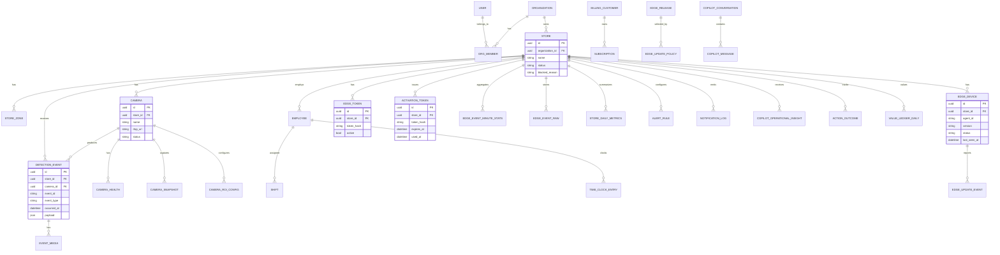

# ERD Completo

Escala: 🟢 CONFIRMADO | 🟡 INFERIDO | 🔴 LACUNA

🟡 INFERIDO: O diagrama mostra as entidades e atributos principais para leitura arquitetural. O dicionario operacional completo esta em `data-dictionary.md`.

🔴 LACUNA: Confirmar constraints, indices e modelos `managed = False` diretamente no banco antes de migracoes destrutivas.
