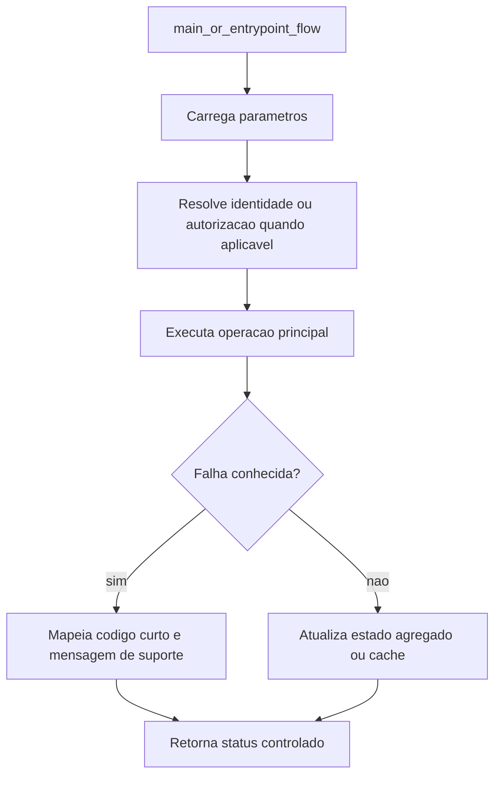

# Fluxograma por funcao principal - edge-agent-vision

```mermaid
flowchart TD
  A[main_or_entrypoint_flow] --> B[Carrega parametros]
  B --> C[Resolve identidade ou autorizacao quando aplicavel]
  C --> D[Executa operacao principal]
  D --> E{Falha conhecida?}
  E -- sim --> F[Mapeia codigo curto e mensagem de suporte]
  E -- nao --> G[Atualiza estado agregado ou cache]
  F --> H[Retorna status controlado]
  G --> H
```
