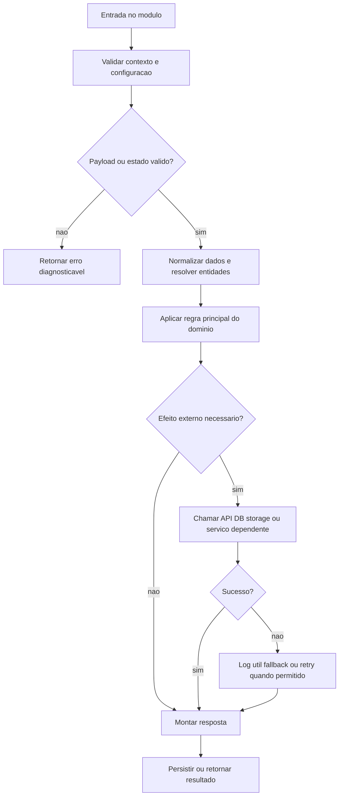

# Fluxograma - edge-agent-vision

```mermaid
flowchart TD
  A[Entrada no modulo] --> B[Validar contexto e configuracao]
  B --> C{Payload ou estado valido?}
  C -- nao --> D[Retornar erro diagnosticavel]
  C -- sim --> E[Normalizar dados e resolver entidades]
  E --> F[Aplicar regra principal do dominio]
  F --> G{Efeito externo necessario?}
  G -- sim --> H[Chamar API DB storage ou servico dependente]
  G -- nao --> I[Montar resposta]
  H --> J{Sucesso?}
  J -- nao --> K[Log util fallback ou retry quando permitido]
  J -- sim --> I
  K --> I
  I --> L[Persistir ou retornar resultado]
```

Confianca: CONFIRMADO para responsabilidades e arquivos; INFERIDO para fluxo abstrato consolidado.
