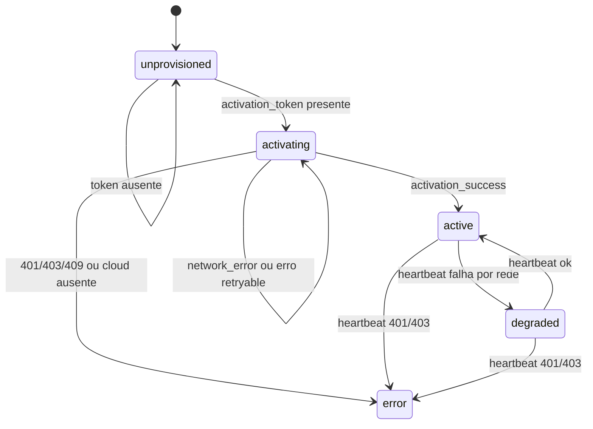
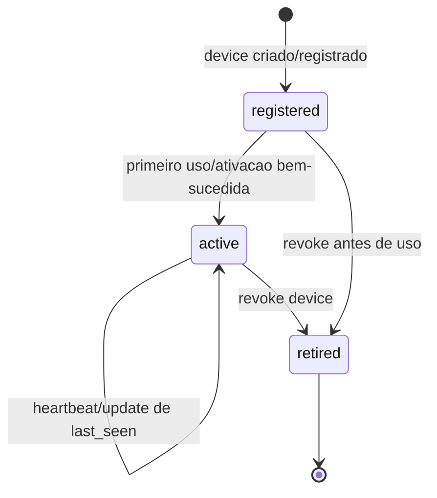
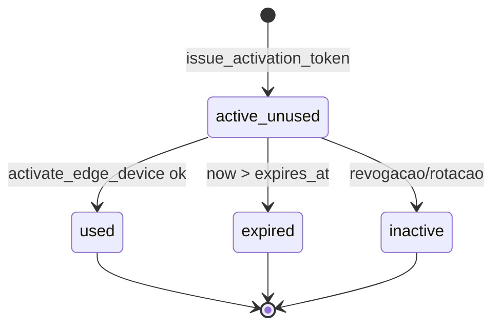
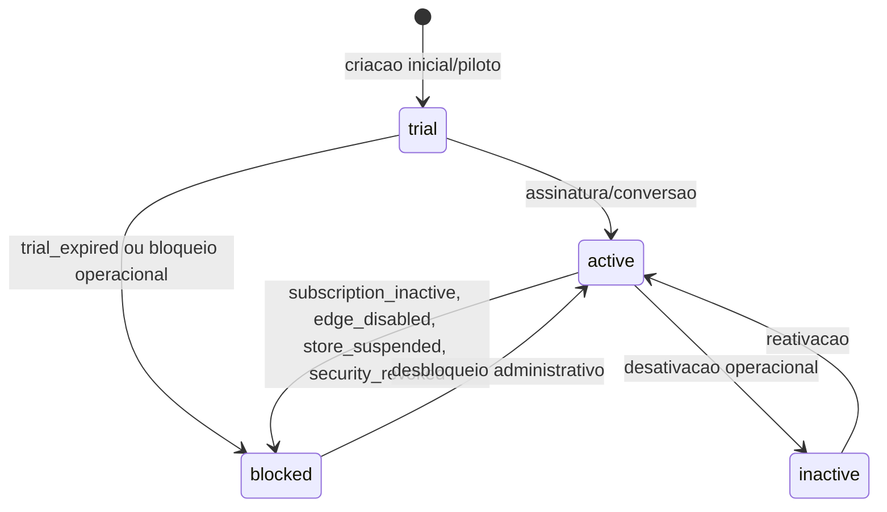
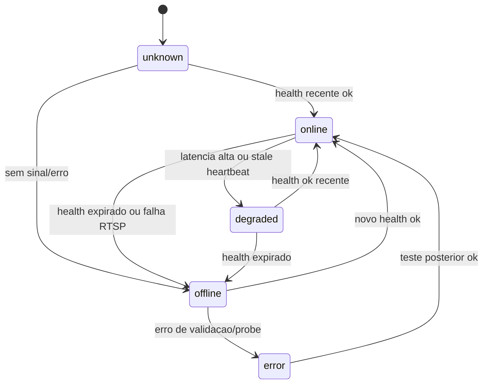
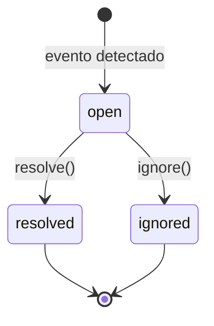
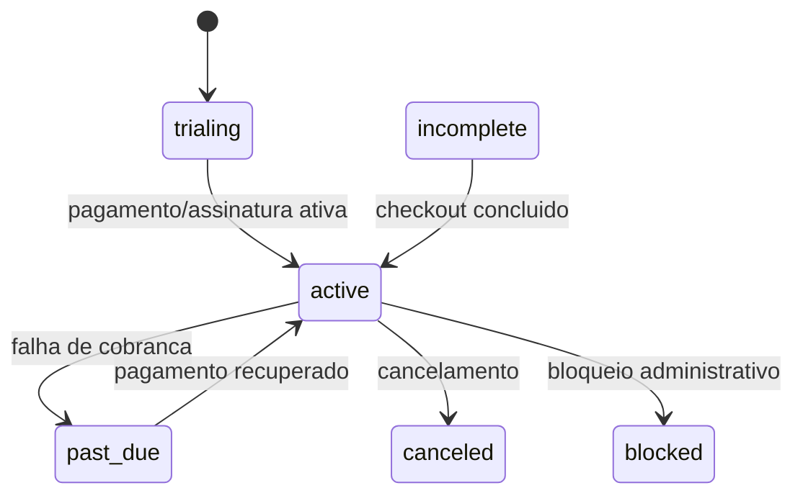
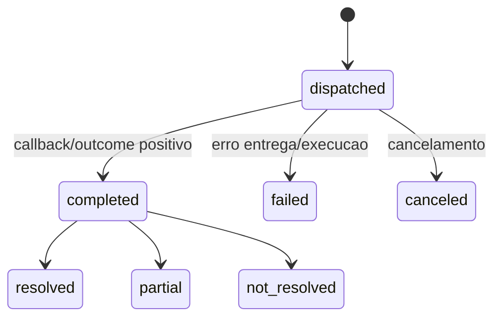
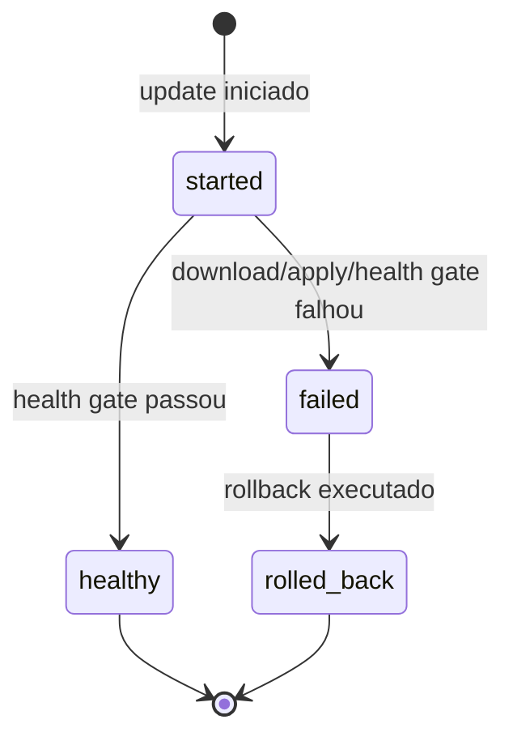

# Maquinas de Estado - DaleVision

Gerado em: 2026-05-06T20:09:09.572994Z

## AgentState

Valores: unprovisioned, activating, active, degraded, error.

Confianca: 🟢 CONFIRMADO por activation.py e tests/test_heartbeat_state.py.

## EdgeDevice

Valores: registered, active, retired.

Confianca: 🟢 CONFIRMADO por EdgeDevice e StoreEdgeDeviceRevokeView; 🟡 INFERIDO para transicao registered->active quando touch/activation registry atualiza status.

## ActivationToken

Valores derivados: active_unused, used, expired, inactive.

Confianca: 🟢 CONFIRMADO por StoreActivationTokenView e modelos; 🟡 INFERIDO para inactive por rotacao/revogacao.

## Store

Valores: active, inactive, trial, blocked.

Confianca: 🟢 CONFIRMADO para valores e bloqueios; 🟡 INFERIDO para transicoes comerciais completas.

## Camera

Valores: online, degraded, offline, unknown, error.

Confianca: 🟢 CONFIRMADO por CAMERA_STATUS, cameras.py e views_edge_status.py.

## DetectionEvent

Valores: open, resolved, ignored.

Confianca: 🟢 CONFIRMADO por EVENT_STATUS e apps/alerts/views.py.

## Subscription

Valores: trialing, active, past_due, canceled, incomplete, blocked.

Confianca: 🟢 CONFIRMADO para valores; 🟡 INFERIDO para gatilhos.

## ActionOutcome

Valores: dispatched, completed, failed, canceled. Resultado: resolved, partial, not_resolved.

Confianca: 🟢 CONFIRMADO por apps/copilot/models.py; 🟡 INFERIDO para gatilhos exatos.

## EdgeUpdateEvent

Valores de status aparecem como started/healthy/failed/rolled_back e fases como policy/download/apply/health_check.

Confianca: 🟢 CONFIRMADO por update.py, views_update.py e commits; 🟡 INFERIDO para taxonomia completa de status/fase.
